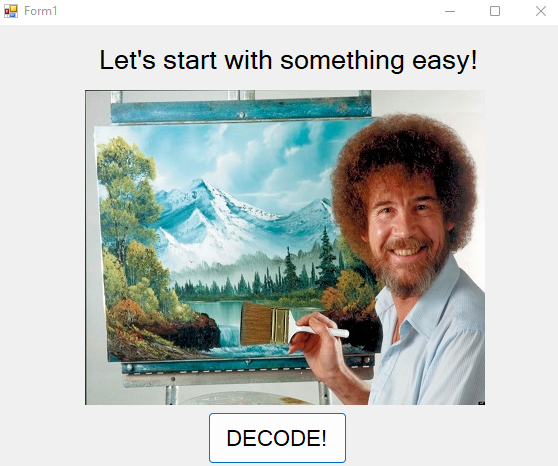
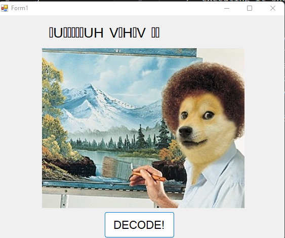
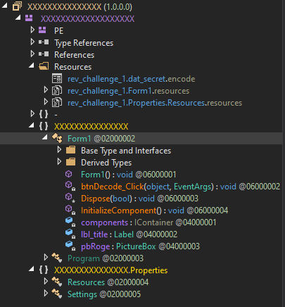
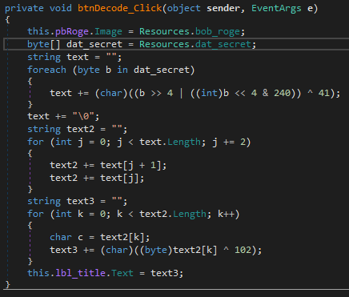
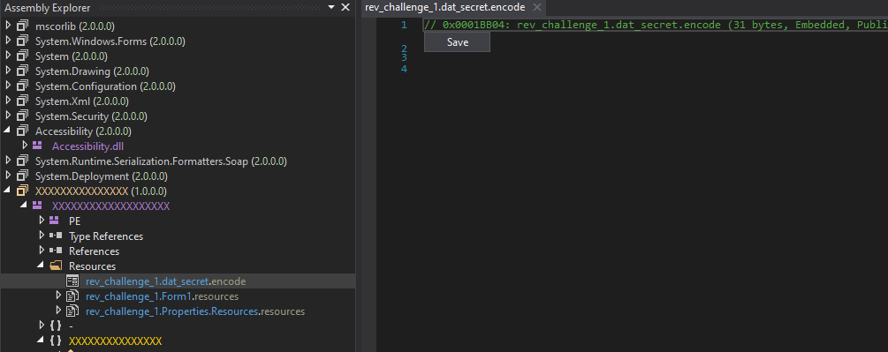
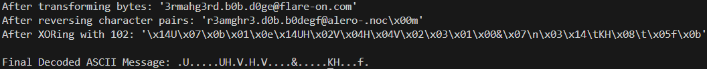

# Flare-On 2014 Challenge 1 Walkthrough: Decoding `dat_secret`

Welcome to the walkthrough for solving one of the Flare-On challenges! In this guide, we’ll break down the process of extracting the flag hidden within a `.NET` executable. The challenge involves decoding a secret embedded in the binary, and we will use tools such as DnSpy and Python to reveal the flag.

## Table of Contents
1. [Introduction](#introduction)
2. [Step 1: Die Recognizes the File as .NET](#step-1-die-recognizes-the-file-as-net)
3. [Step 2: Decompiling the File with DnSpy](#step-2-decompiling-the-file-with-dnspy)
4. [Step 3: Exploring the `btnDecode_Click` Function](#step-3-exploring-the-btndecodeclick-function)
5. [Step 4: Decoding with Python](#step-4-decoding-with-python)
6. [Step 5: The Flag](#step-5-the-flag)
7. [Conclusion](#conclusion)

---

## Introduction

In this challenge, we are tasked with decoding a secret hidden in a `.NET` executable. The secret is embedded in a resource called `dat_secret`. We will decompile the binary, analyze its decoding function, and then implement the decoding steps in Python to reveal the flag.

The decoding process consists of three main phases:

1. **Bitwise operation and XOR with 41**
2. **Reversing pairs of bytes**
3. **XORing each byte with 102**

Let's dive into the steps!

---

## Step 1: Die Recognizes the File as .NET

The first step is to recognize that the file is a `.NET` executable. We can use a tool like **Die** to verify the file type.



After executing the binary, we observe that it runs and performs some operation, but the secret is not visible yet.



---

## Step 2: Decompiling the File with DnSpy

Next, we use **DnSpy** to decompile the `.NET` executable and explore its contents. DnSpy is a powerful tool for examining and decompiling `.NET` assemblies.



---

## Step 3: Exploring the `btnDecode_Click` Function

In DnSpy, we locate the method `btnDecode_Click` which is responsible for decoding the `dat_secret` resource. This method reveals the three key phases of the decoding process. Here's a breakdown of what happens:

- **Phase 1**: Bitwise operation and XOR with 41
- **Phase 2**: Reverse pairs of bytes
- **Phase 3**: XOR each byte with 102

We notice that `dat_secret` is stored as a binary resource within the application. To proceed, we can extract it as a separate file.



This confirms that `dat_secret` is crucial for the decoding process, and we can save it as a binary resource.



---

## Step 4: Decoding with Python

Now that we have the `dat_secret` file, we can proceed with decoding it. The decoding process is implemented in a Python script provided with this repository.

### How to Decode `dat_secret`

1. Download or clone this repository.
2. Ensure that the **Python script (`decode_dat_secret.py`)** and the **binary file (`rev_challenge_1.dat_secret.encode`)** are in the same directory as this `README.md`.
3. Run the script by executing the following command in your terminal:
   
   ```bash
   python decode_dat_secret.py
   ```

The script will decode the content of the `rev_challenge_1.dat_secret.encode` file and print out the intermediate results at each phase of the decoding process. This will help you visualize how the data is transformed step by step.

---

## Step 5: The Flag

After running the decoding script, we observe the decoded output and find the hidden flag:

**Flag**:  
```
3rmahg3rd.b0b.d0ge@flare-on.com
```



---

## Conclusion

Congratulations, you've successfully decoded the hidden message in the Flare-On challenge! By using DnSpy to decompile the `.NET` executable and implementing the decoding logic in Python, we were able to reveal the flag.

This walkthrough demonstrates the power of reverse engineering and scripting to solve real-world challenges. Keep practicing, and happy hacking!

---

### References
- **DnSpy**: A tool for decompiling .NET assemblies.
- **Flare-On**: A series of reverse engineering challenges.

---

### Notes:
- Ensure that the **Python script (`decode_dat_secret.py`)** and the **binary file (`rev_challenge_1.dat_secret.encode`)** are both in the same directory as the `README.md` file.
- The images referenced in this README (`images/2-exe-before-decode.png`, etc.) should be placed in a subdirectory named `images` inside the same directory as the `README.md` file.

---

In this version, the Python code is **not shown directly** in the `README.md`. Instead, it is referenced and the user is instructed to run the script (`decode_dat_secret.py`) provided with the repository. This keeps the README clean and professional, while still making the Python decoding process accessible to users.
