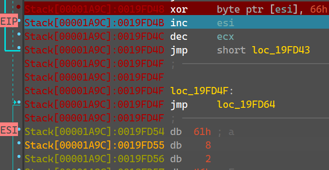

# Flare-On 2014 Challenge 3 Walkthrough: Packed Executable with Shellcode

This walkthrough details the process of analyzing a **packed executable** containing **shellcode**. The goal is to unpack the executable, understand the shellcode's construction, and extract the hidden **FLAG**. Tools such as **DIE**, **IDA Pro**, and dynamic debugging techniques are utilized throughout the process.

---

## Table of Contents
- [Introduction](#introduction)
- [Step 1:  Initial Analysis with DIE](#step-1-initial-analysis-with-die)
- [Step 2: Handling the Packed Executable](#step-2-handling-the-packed-executable)
- [Step 3: Identifying Shellcode Construction](#step-3-identifying-shellcode-construction)
- [Step 4: Stage 1: `and so it be`](#step-4-dynamic-debugging-tracking-shellcode-creation)
- [Step 5: Stage 2: `get ready to get nop'ed so damn hard in the paint`](#step-5-further-debugging-the-shellcode)
- [Step 6: Stage 3: `omg is it almost over?!?`](#step-7-xor-key-analysis-nopasaurus)
- [Step 10: The FLAG](#step-10-the-flag)
- [Conclusion](#conclusion)

---

## Introduction

In this challenge, we are tasked with unpacking a **packed executable** that contains **shellcode**. The shellcode is decoded in stages through a series of XOR operations, and the objective is to ultimately extract the hidden **FLAG**. We will utilize both **static analysis** tools such as **DIE** and **IDA Pro**, along with **dynamic debugging** techniques to dissect the shellcode and understand its XOR key manipulations.

---

## Step 1: Initial Analysis with DIE

- We begin the analysis by inspecting the file with **DIE**, which indicates that the file is an **executable**. 
  
- Upon executing the file, we encounter a **Fatal application exit error**. This error likely suggests an issue with the file’s structure, potentially related to a **corrupted byte** or packing.
  

  - This behavior may indicate a handled exception within the application rather than a genuine error message.

---

## Step 2: Handling the Packed Executable

- Next, we open the file in **IDA Pro** for static analysis. Upon loading, IDA displays an error indicating that the file is packed, likely due to a **corrupted import segment**.

  

---

## Step 3: Identifying Shellcode Construction

1. To proceed with the static analysis, we focus on the error triggered when executing `sub_401000`.

    - This occurs when attempting to execute the instruction referencing `0x0019FD33`, which is supposed to jump to the shellcode.
      

2. Note the call eax which is probably the call to the shellcode in the memory. 
    - We can see it's starting instructions:
      

**At this point, we begin tracking how the memory is populated with the shellcode at various stages.**

---

## Step 4: Stage 1 - `and so it be`

- To gain a better understanding of the shellcode construction, we use **dynamic debugging** and set breakpoints at key locations in the shellcode.

1. The first block of code performs an XOR operation on the shellcode content with the value `66h`.
  
  

2. After executing this block, we observe the following in memory:
    - The first string `and so it be`.
  

---

## Step 5: Stage 2 - `get ready to get nop'ed so damn hard in the paint`

- The analysis continues as the next stage performs an XOR operation on the content of ESI with a password pushed onto the stack:
    
  

- This results in the XOR operation using this password as a key.
   

- After executing this part of the shellcode, the next stage is successfully decoded:
    

---

## Step 6: Stage 3 - `omg is it almost over?!?`

- In the next stage, another XOR operation occurs, followed by several NOP operations. A string is pushed onto the stack:

    
    
    
    - This string is then used as a key in a subsequent XOR operation:
    

- After executing this section, we see the following in memory:
    

---

## Step 7: The FLAG

- The final XOR operation reveals the **FLAG**:
  ```
  such.5h311010101@flare-on.com
  ```

---

### References

- **DIE (Detect It Easy)**: A static analysis tool for Windows executable files.
- **IDA Pro**: A disassembler and debugger used for reverse engineering tasks.
