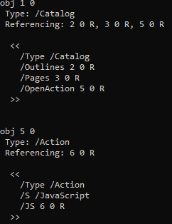
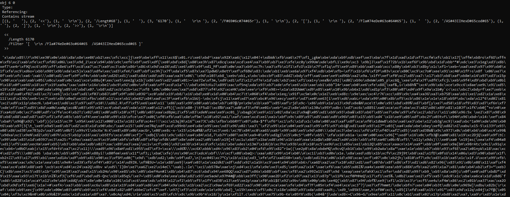
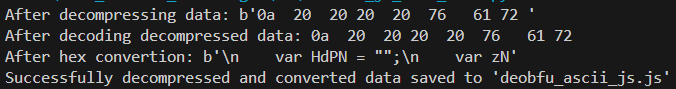
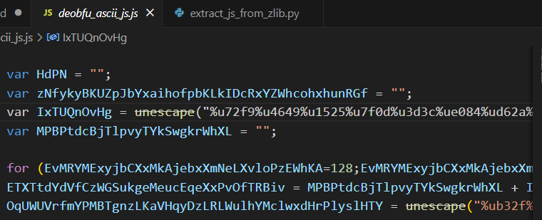
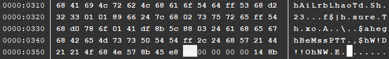
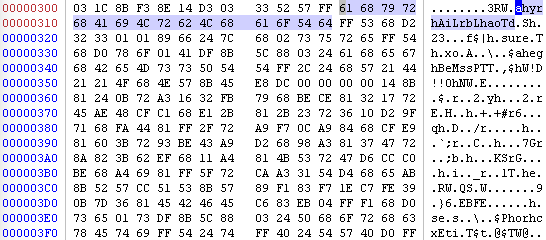
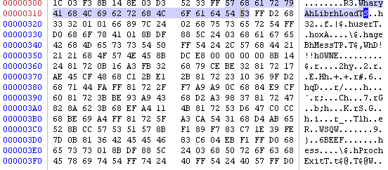
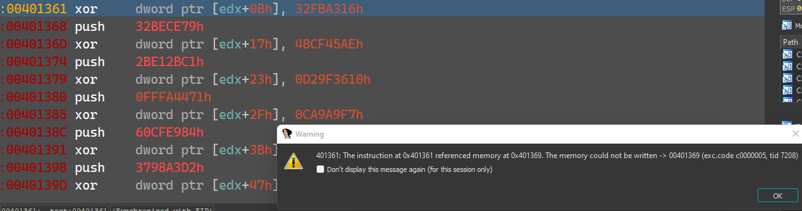
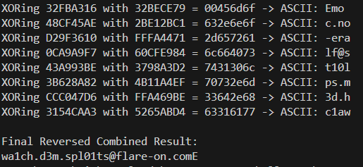

# Flare-On 2014 Challenge 4: Malicious PDF with Embedded Shellcode

This walkthrough details the process of analyzing a **malicious PDF** that contains **JavaScript** and **shellcode**. The goal is to extract and execute the shellcode to reveal the hidden **FLAG**. Tools such as **pdf-parser**, **DIE**, **IDA Pro**, and custom Python scripts are utilized throughout the process.

---

## Table of Contents
- [Introduction](#introduction)
- [Step 1: Initial PDF Analysis with pdf-parser](#step-1-initial-pdf-analysis-with-pdf-parser)
- [Step 2: Investigating PDF Objects](#step-2-investigating-pdf-objects)
- [Step 3: Extracting and Deobfuscating the JS](#step-3-extracting-and-deobfuscating-the-js)
- [Step 4: Analyzing the JS and extract the Shellcode](#step-4-analyzing-the-js-and-extract-the-shellcode)
- [Step 5: Correcting Byte Order: Little Endian](#step-5-correcting-byte-order-little-endian)
- [Step 6: Converting Shellcode to Executable](#step-6-converting-shellcode-to-executable)
- [Step 7: Debugging the Shellcode](#step-7-debugging-the-shellcode)
- [Step 8: The FLAG](#step-8-the-flag)
- [References](#references)

---

## Introduction

In this challenge, we are tasked with analyzing a **malicious PDF** that contains embedded **JavaScript** and **shellcode**. The JavaScript is obfuscated, and the shellcode is hidden within the PDF. Our goal is to extract the shellcode, execute it, and reveal the hidden **FLAG**. We will utilize **pdf-parser** for initial analysis, along with **DIE**, **IDA Pro**, and custom Python scripts for deobfuscating and analyzing the shellcode.

---

## Step 1: Initial PDF Analysis with pdf-parser

We begin by analyzing the PDF with **pdf-parser** to search for embedded actions or scripts:

- Execute the following command to search for the string `'action'` within the PDF:
  ```bash
  pdf-parser.py APT9001.pdf -s action
  ```
  - This command searches for any actions or embedded JavaScript that might be present.
  
    

- The output shows several objects, indicating that the PDF may contain JavaScript or other embedded actions.

---

## Step 2: Investigating PDF Objects

Next, we investigate object 6 - `JavaScript` object within the PDF:

- Run the following command to display verbose output for objects 1 and 5:
  ```bash
  pdf-parser.py APT9001.pdf -o 6 -c -D -v
  ```

- Object **6** is found to contain a **JavaScript reference**, but the content is **obfuscated**.
  
  

---

## Step 3: Extracting and Deobfuscating the JS

1. Now, we extract the obfuscated JavaScript content and attempt to deobfuscate it:
    - Dump the content of object **6** with the following command:
      ```bash
      pdf-parser.py APT9001.pdf -o 6 -d obfu_js.mal
      ```
      - This saves the obfuscated content that **pdf-parser** couldn't fully decode.

    - After dumping the content, we used **DIE** (Detect It Easy) to identify the encoding, which turns out to be a **zlib archive**.
- Decompressing the archive with the **extract_js_from_zlib.py** script allowed us to decode the hexadecimal values into ASCII.
  - The result was saved as `deobfu_ascii_js.js`, which still had some unclear parts.
  
  

---

## Step 4: Analyzing the JS and extract the Shellcode

- The content looked like:
  
    - Before trying to decode all the script let's focus on the escaped strings:
    - **"%u72f9%u4649..."** and after decoding:
    

To better analyze the dumped data, we need to unescape the obfuscated string:

- Use the **deobfu_escaped.py** script to:

 1. `little_endian_encoded_shellcode.bin` - Convert **%uXXXX** Unicode escapes into actual ASCII characters.
    

    - _Notice_: The data is shown in reversed order (little-endian)
                -  [Little-Endian in IDA - binary search](https://hex-rays.com/blog/igors-tip-of-the-week-48-searching-in-ida)

  - The script will also decode little-endian dumped binary data.
---

## Step 5: Correcting Byte Order: Little Endian

2. `little_endian_decoded_shellcode.bin` - Reverse any pair of hex-values
  

---

## Step 6: Converting Shellcode to Executable

A shellcode cannot be executed without an executable that will make it happen.

- Using the **shcode2exe** script from GitHub, we converted the shellcode into an executable:
  ```bash
  python ./shcode2exe.py -o little_endian_sc.exe little_endian_decoded_shellcode.bin
  ```

  - **Shellcode to EXE**: [shcode2exe](https://github.com/accidentalrebel/shcode2exe)

---

## Step 7: Debugging the Shellcode

We now analyze the **little_endian_sc.exe** in **IDA Pro**:
   - Open the executable in **IDA** and track the flow of the shellcode.
   - By stepping through the instructions, we encountered an error while attempting to perform XOR operation (probably because we're not exploiting the vulnerable PDF reader that was meant for this challenge)
      
      
---

## Step 8: The FLAG

To bypass this issue i've wrote a Python script to decrypt the values which revealed the **FLAG**
  - Execute `build_xored.py`
      


- **FLAG**:  
  `wa1ch.d3m.spl01ts@flare-on.com`

---

### References

- **pdf-parser**: A tool for analyzing and parsing PDF files.
- **DIE (Detect It Easy)**: A tool for detecting file types and analyzing embedded content.
- **IDA Pro**: A disassembler and debugger for reverse engineering tasks.
- **shcode2exe**: A script for converting raw shellcode into executable files.
