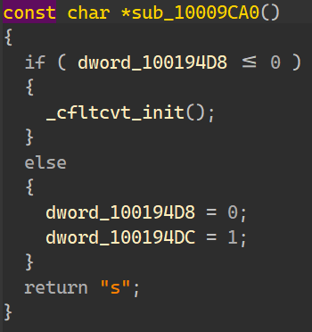
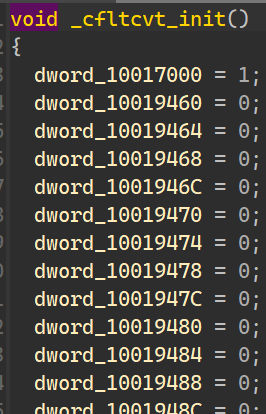

# Flare-On 2014 Challenge 5 Walkthrough: Reverse Engineering Keylogger DLL

Welcome to the walkthrough of solving a **Flare-On challenge**! In this guide, we’ll break down the process of analyzing a **DLL malware sample**, identifying its behavior, and extracting the hidden **FLAG**. We’ll use tools like **DIE**, **IDA Pro**, and examine the keylogging functionality to uncover the hidden secrets.

---

## Table of Contents
- [Introduction](#introduction)
- [Step 1: DIE Recognizes the File as a DLL](#step-1-die-recognizes-the-file-as-a-dll)
- [Step 2: Static Analysis with IDA Pro](#step-2-static-analysis-with-ida-pro)
- [Step 3: Investigating the Keylogging Wrapper](#step-3-investigating-the-keylogging-wrapper)
- [Step 4: Understand the Flag sequence](#step-4-understand-the-flag-sequence)
- [Step 5: Extracting the FLAG](#step-5-extracting-the-flag)
  - [IDAPython Helper Script](#idapython-helper-script)
  - [Key Functions](#key-functions)
  - [Additional Helper Functions](#additional-helper-functions)
  - [Last Char](#last-char)
- [Step 6: The FLAG](#step-6-the-flag)
- [References](#references)

---

## Introduction

In this walkthrough, we will analyze a **DLL malware sample** by reverse engineering it. The malware implements a keylogging functionality and hides a flag within its execution. We will use a combination of static analysis tools and code inspection to extract the hidden **FLAG**. The key steps include:

1. Recognizing the file type with **DIE**.
2. Performing **static analysis** using **IDA Pro**.
3. Investigating the **keylogging function** and understanding its behavior.
4. Decoding the **FLAG** using cross-references and function tracing.

Let's dive into the steps!

---

## Step 1: DIE Recognizes the File as a DLL

- The first step in analyzing the malware is identifying the file type. 
- We can use **DIE** (Detect It Easy) to determine that the file is a **DLL**.

  

  - This indicates that the file is likely used by other processes, and could be injected or loaded dynamically.

---

## Step 2: Static Analysis with IDA Pro

Next, we open the **DLL** file in **IDA Pro** for a more detailed static analysis. Upon inspection, we focus on the **DLLMain** function, where the malware’s initial behavior is defined.


**Persistence:**
1. **sub_1008A570** - Check for old persistence:
  

    - The malware check if svchost value exists under the mentioned key

2. **sub_1000A610** - Ensure registry value:
  

    - **This ensures this file will be executed on every startup**

3. The malware **copies itself** to `svchost.dll` and `rundll32.exe` before calling **`sub_1000A4C0`** on the modified `svchost.dll`

---

## Step 3: Investigating the Keylogging Wrapper

1. After these actions, the malware calls the function **sub_1000A4C0**.

    

2. I'll explain the keylogger functionality in the next section. in this one i'll summarize the main functionality of this keylogger:
    - We can see that keylogger will return buffer that is an input for the function `sub_10001000`
    

---

## Step 4: Understand the Flag sequence

  

  - Checking for a range of keyboard presses
  - On a valid press the loop will break and continue to `switch` statement.

1. Depending on the key pressed, the program triggers different actions (switch-case). For example:
    - Some keys contribute to a sequence.
    - Some keys reset the sequence.
    - Notably, pressing the letter **'m'** triggers a function that prints the **Flare-On logo**.

2. Checking some of the functions reveals:
    - Letter `s`:
      
      

    - Letter `p`:
      
      

3. `_cfltcvt_init()` seems to be some reset function:
   
    

    - It's look like there is a correlation between the dwords in the functions for the chars:
    
      

    - Let's check what would make this dword marked:
      
      

5. This pattern made me think of a script that will extract the flag...
    - For each xref of a dword we need to know which function marked it to `1`.
    - Each function returns the relevant char (if it was marked)

---

## Step 5: Extracting the FLAG

To decode the hidden **FLAG**, I used **cross-references (x-refs)** in IDA Pro to trace all the functions triggered by the keylogger's switch-case block. By following the functions and examining the memory they accessed, I was able to identify the encoded flag.

I then ran the **"convert_dwords.py"** Python script to decode the flag from its encoded form.

  - ### IDAPython Helper Script

    This script provides a set of utilities to assist with analyzing binary functions and uncovering key patterns, such as flag sequences or function calls, using IDA Pro. Below is an overview of the key components and functionalities:

  - Renaming relevant functions:
    
      

  - Fetching relevant XRefs:
    
      

  - The Flag:
  
      

    - ### Key Functions:

      - **`find_flag_in_range`**  
        Identifies and fetches all the functions invoked within a target function that is part of a switch-case or similar control flow structure.

      - **`process_function_calls`**  
        This function iterates through the function calls to check for specific conditions related to a flag sequence or reset:
        - **`handle_called_function`**: This inner function processes the called functions and determines whether they involve a reset sequence. It checks for:
          - Calls to the `cfltcvt_init` function.
          - Conditional blocks that might indicate a sequence reset.
        - If the function verifies the presence of a character in the sequence, it will rename it using the `retrieve_value_from_offset` function, with names like `char_<?>`.

      - **`print_cross_references_to_dwords_in_function`**  
        This function helps reconstruct the flag by analyzing how functions reference specific data elements, often identifying key sequences or flags. It leverages:
        - **`is_dword_operation`**: Determines whether a `dword` is being accessed.
        - **`collect_xrefs_to_dwords`**: Tracks cross-references to `dwords`, marking relevant characters in the flag sequence.

    - ### Additional Helper Functions:

      - **Instruction Checks**:  
        Several helper functions are implemented to facilitate the analysis, including:
        - Verifying if an instruction is of the form `mov eax, <const>`.
        - Checking if `<const>` is equal to `0` or `1`.
        - Determining if a function contains conditional statements.

    - ### Last char:
      - The script manually adds the letter `m` because the sequence ends with `...co`
      - Checking the function that is relevant for the letter `m` shows:

        
  
      - Checking `sub_10001240` shows the string:

        

## Step 6: The FLAG
  - The script will construct the right **FLAG**:
    
      
    ```
    l0gging.ur.5tr0ke5@flare-on.com
    ```

---

## References
- **DIE**: A tool for identifying file types and embedded resources within executable files.
- **IDA Pro**: A disassembler and debugger used for static analysis of executables, DLLs, and other binary formats.
- **IDAPython**: A powerful Python API designed to automate tasks and perform advanced analysis within IDA Pro.
  - It is useful for writing automation scripts and interacting with the IDA Database.
  - For a more efficient development experience, I recommend using the [`IDACode`](https://github.com/ioncodes/idacode) VSCode extension, which simplifies writing and debugging IDAPython scripts.

---
