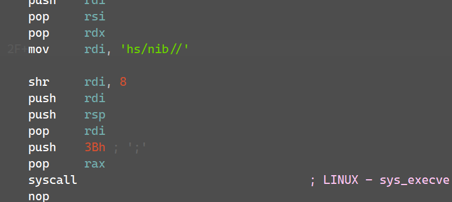

### Flare-On 2014 Challenge 6 Walkthrough: Reverse Engineering an ELF Binary with Shellcode

In this walkthrough, we will explore the steps taken to analyze and reverse engineer an **ELF** binary in the **Flare-On 2014** challenge. This process includes techniques such as **static analysis** using **IDA Pro**, **dynamic analysis** with **strace**, and **debugging** to eventually extract the hidden **FLAG** embedded within custom **shellcode (SC)**.

---

## Table of Contents
- [Introduction](#introduction)
- [Step 1: Initial Analysis](#step-1-initial-analysis)
- [Step 2: Static Analysis with IDA Pro](#step-2-static-analysis-with-ida-pro)
- [Step 3: Debugging the Two Arguments Case](#step-3-debugging-the-two-arguments-case)
- [Step 4: Analyzing the "bad" Message](#step-4-analyzing-the-bad-message)
- [Step 5: Debugging the Second Argument](#step-5-debugging-the-second-argument)
- [Step 6: Advanced Debugging: Loops and Shellcode (SC)](#step-6-advanced-debugging-loops-and-shellcode-sc)
- [Step 7: Decoding the FLAG](#step-7-decoding-the-flag)
- [References](#references)

---

## Introduction

This walkthrough describes the process of analyzing a **ELF binary** encountered in the **Flare-On 2014** challenge. The goal was to reverse engineer the binary, bypassing anti-debugging mechanisms, decoding embedded **shellcode (SC)**, and extracting the hidden **FLAG**. 

The key steps included:

1. **Initial analysis** with **DIE** and **basic execution**.
2. Performing **static analysis** using **IDA Pro**.
3. **Dynamic analysis** with **strace** and **debugging** techniques.
4. Extracting and analyzing the **shellcode (SC)**.
5. **Decoding the FLAG** from the shellcode.

---

## Step 1: Initial Analysis

Upon initial inspection, I used **DIE** (Detect It Easy) to identify the binary as an **ELF** file. Executing it produced different outputs depending on the input provided, as seen below:

**Example Output**:

- **"na"**, **"no"**, and **"stahp"** messages were printed based on the input arguments.
  - 

---

## Step 2: Static Analysis with IDA Pro

I performed **static analysis** with **IDA Pro** running on a remote Ubuntu VM. The binary contained a large number of functions, so I focused on searching for string references that matched the output seen during execution.

### 2.1 Searching for Strings

I searched for strings like `na`, `no`, `bad`, and `stahp`, which revealed blocks of code corresponding to these outputs.

- **"na"** output appeared with one argument (besides the filename argument):
  - 
  - 
- **"no"** output appeared with zero arguments:
  - 
- **"stahp"** output appeared with three or more arguments.

The **"two arguments"** (`bad`) case stood out, so I decided to investigate it further.

---

## Step 3: Debugging the Two Arguments Case

When the binary was executed with **two arguments** (Using IDA), it triggered a **segmentation fault**.

- **Segfault** observed during execution:
  - 

The error was traced to a conditional block involving a **ptrace** system call.

- `strace` which show a list of system calls made by an ELF showed the following:
  - execute: `strace -i <elf> arg1 arg2`
  

### 3.1 Investigating ptrace

The **ptrace** system call is used for debugging, and it was being utilized by the binary to check if a debugger was attached. When detected, it returned `-1`. To bypass this, I patched the `jmp` (without a condition) instruction to `jnz` (jump if not zero).

- **`ptrace` at address `47431b` called by `sub_4742B0`:**
  

- Later, we can see that the call for this anti-debug check prints the seg-fault error.
  - It's happening with `ptrace` when a debugger is attached
  - ptrace will return -1 if a debugger is attached (as we can see in the output of `strace`)
  - To bypass it we want the `jz` to be always `True` in order to achieve it.
  

- **Patched ptrace disassembly**:
  
  
- **`strace` after bypassing anti-debug**
  

---

## Step 4: Analyzing the "bad" Message

After bypassing the `ptrace` anti-debug we still get `bad` printed.
This made me start analyzing the diassembly from `bad` occurences:
  

### 4.1 Analyzing `bad` occurences
  1. I'll start by setting breakpoints in both occurences and dynamically debug it
      - This can be achieved with `Remote Linux Debugger` and setting a linux-host 
        - [Remote Debugging Linux From Windows with IDAPro](https://eviatargerzi.medium.com/remote-debugging-with-ida-from-windows-to-linux-4a98d7095215) 
  
  2. Once executed we'll see that we arrived at `0x43710C`. Let's see what happend before.

      

      - Set up a breakpoint to the start of this block and let's start reversing it!

  3. The process of this block will:
      - RAX will point to the first argument:
      
      - `reoebe scasb`:
          - `RDI`, which points to Arg[1] will be compared to AL (which is NULL `0`)
          - Updateds `RAX` which is a counter that starts at `FFFFFFFFFFFFFFFFFF` and substracts after each iteration on Arg[1]
          - Then `RCX` will count the chars untill the NULL char (`/0`)
          - This method will sum to the next decompiled code:
            
  
  4. This indicates that the input needs to be 10 chars
      - Let's repeat the last process and reverse the block before the next `bad` occurence.
        
        
      - We can sync the decompiled view with IDA Assembly view to search for the block responsible for the XOR operation being perofmred before the next `bad` occurence.
      - This will reveal the next step taking before understanding Arg[1]:
        


### 4.2 XORing Arg[1]

- As the decompiled version suggest, each char of `v3` is going to be xored with the value `56h`. The output of this step will result Arg[0] Xored with `56h`
  

  For example:
  - `'0123456789' XOR 56h` results in `'gdebc\anof'`.

I used a **Python script** (`xored_arg0.py`) to calculate the XOR transformation and confirmed it with **CyberChef**.

- Let's use **`CyberChef`** to decode the compared string `bngcg'debg`
  

- Then, we can try to reverse the next function that takes as input [Xored Arg[1], String_Length(`10`), String: `bngcg'debd`]
  
  - It's not practical.. so i'll assume that the function is just a `strcmp` that IDAPro failed to recognize.

- **XORED Value of `bngcg'debd`**: `4815162342`
  - When it's the first argument we bypass the `bad` prints
---

## Step 5: Debugging the Second Argument

The second argument (**Arg[2]**) caused the binary to enter multiple loops. I used **strace** to investigate this.

- **strace output** showed that the binary was stuck on a **sleep**:
  

I patched the **nanosleep** system call to skip over the sleep call during debugging.

- **Before patching**:
      

- **After patching**:
      

---

## Step 6: Advanced Debugging: Loops and Shellcode

### 6.1 Getting to Shellcode
- After some loops i've concluded that there are no chances to understand and bypass. i checked the Function tracing of IDA to know where the last operation performed.

- To find the address range in which the program terminates i've managed to use many breakpoints to skip some loops.

- Finally, i've found the wrapping function that makes the file exist without continuing to the next code:
  

- Repeating the process of executing between different subs untill the code terminates got me to:
    
  
  

- Then, in the Assembly view you'll notice the following:
  

During debugging, I reached a point where the binary began executing **custom shellcode** - `call rdx`. The shellcode was processed in loops with the second argument (**Arg[1]**) playing a crucial role.

### 6.1 Shellcode Construction

- The shellcode was decoded and constructed in memory, with **984 bytes** of memory allocated at **var_4400**, and data starting from **byte_729900**.
  - The first bytes were ASCII for "SIx", and the shellcode was later converted into `48 89 F8`.
  - Also, we can see Arg[2] passed to the shellcode (`mov rax,rdi`)
    
  - To ease the SC debugging i've decided to dump it. use the following IDAPython script:
    ```python
    import idaapi

    def memdump(ea, size, file):
        # Using idaapi.get_bytes() to get the byte data from the given address
        data = idaapi.get_bytes(ea, size)
        
        # Writing the bytes to a file
        with open(file, "wb") as fp:
            fp.write(data)
            print("Dumped...")

    # Example usage: Dump memory from address <fill>, size 984 bytes, into "dumped_sc.bin"
    memdump(<address of constructed sc>, 984, "dumped_sc.bin")

    ```

### 6.2 **Dumped Shellcode Entrypoint**:
  

  - we can see that the offset inside the shellcode are calculated properly for it's execution.

  - As we dive deeper we see many blocks that are responsible for decoding Arg[2].

---

## Step 7: The FLAG

After reversing the **shellcode**, I used a Python script (`decode_flag.py`) to extract the FLAG.

- **Extracted FLAG**:
  - `l1nhax.hurt.u5.a1l@flare-on.com`

- supplying the decoded arguments to the ELF will result the next syscall:
  
  - This indicates that the ELF will try to connect to the supplied address to supply a C2 with a backdoor to `/bin/sh` on the victim host:
  

---

## References
- **DIE (Detect It Easy)**: A tool used for identifying file types and embedded resources.
- **IDA Pro**: A powerful disassembler and debugger used for static analysis of binaries.
- **ptrace**: A system call used for debugging and detecting debuggers.
- **strace**: A tool for tracing system calls during program execution.
- **CyberChef**: A web-based tool used for analyzing and transforming data, including XOR and base64 decoding.

---

This completes the walkthrough for the **Flare-On 2014** challenge. Let me know if you'd like further details or clarifications!
