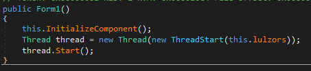

# Flare-On 2014 Challenge 7 Walkthrough: some header for this challenge

In this walkthrough, I’ll cover the detailed analysis of the executable encountered in the **Flare-On 2014 Challenge 7**. This walkthrough explains how I reversed and debugged the executable, the anti-debugging tricks employed by it, and how I finally extracted valuable information. Along the way, I will highlight key points, anti-debugging techniques, and explain each function's purpose.

---

Here is the updated Table of Contents (TOC) for your walkthrough:

---

## Table of Contents

1. [Initial Analysis](#1-initial-analysis)
2. [Basic Dynamic Analysis](#2-basic-dynamic-analysis)
3. [Starting IDA Pro](#3-starting-idapro)
4. [Reversing Key Functions](#4-reversing-key-functions)
    - 4.1 [Anti-Debugging (Sub_951030: `Chk_IsDebuggerPresent`)](#41-anti-debugging-sub_951030-chk_isdebuggerpresent)
    - 4.2 [Process Environment Block Check (Sub_9510C0: `Chk_PEB_BeingDebugged`)](#42-process-environment-block-check-sub_9510c0-chk_peb_beingdebugged)
    - 4.3 [VMware Detection (Sub_951130: `Chk_SIDT_Vmware`)](#43-vmware-detection-sub_951130-chk_sidt_vmware)
    - 4.4 [Hypervisor Detection (Sub_9511D0: `Chk_VMX_IO_Port`)](#44-hypervisor-detection-sub_9511d0-chk_vmx_io_port)
    - 4.5 [Debugger Check (Sub_9512A0: `Chk_Output_Debug_Str`)](#45-debugger-check-sub_9512a0-chk_output_debug_str)
    - 4.6 [Software Breakpoint Detection (Sub_951350: `Chk_Software_Breakpoints`)](#46-software-breakpoint-detection-sub_951350-chk_software_breakpoints)
    - 4.7 [NtGlobalFlags Check (Sub_9513F0: `Chk_NtGlobalFlags_Debugged`)](#47-ntglobalflags-check-sub_9513f0-chk_ntglobalflags_debugged)
    - 4.8 [Time Check (Sub_851460: `Chk_Friday`)](#48-time-check-sub_851460-chk_friday)
5. [Program Path](#5-program-path)
6. [Further Function Analysis](#6-further-function-analysis)
    - 6.1 [Executable Name Check (Sub_9514F0: `Chk_Name_backdoge`)](#61-executable-name-check-sub_9514f0-chk_name_backdoge)
    - 6.2 [IP Address Resolution Debugging (Sub_951590: `ChkDebugged_IP_Resolved`)](#62-ip-address-resolution-debugging-sub_951590-chkdebugged_ip_resolved)
    - 6.3 [Time Check for 5PM (Sub_9516E0: `Chk_Time_5PM`)](#63-time-check-for-5pm-sub_9516e0-chk_time_5pm)
7. [XOR Data with Executable Path](#7-xor-data-with-executable-path)
8. [Root Server and Twitter URL Check](#8-root-server-and-twitter-url-check)
    - 8.1 [Root Server Check (Sub_9517A0: `Chk_ERoot_Servers`)](#81-root-server-check-sub_9517a0-chk_eroot_servers)
    - 8.2 [Tweet Check (Sub_9518A0: `Chk_Twitter_URL`)](#82-tweet-check-sub_9518a0-chk_twitter_url)
9. [Crashing Issue with Executable](#9-crashing-issue-with-executable)
10. [Creating the Working Executable](#10-creating-the-working-executable)
11. [Extracting the FLAG](#11-extracting-the-flag)
    - 11.1 [Decoding Data](#111-decoding-data)
12. [Final Note](#12-final-note)

---

### 1. Initial Analysis

The executable is detected as a **Windows** binary.

- **DIE** (Detect It Easy) marks the file as an executable.
- The file **stops execution after a few seconds**.
- **ApateDNS** shows several DNS requests:
  
    

---

### 2. Basic Dynamic analysis

- I've monitored (Procmon) the execution of the executable with 0~2 arguments.
  - Noticed that for 2 arguments there is a reference to `grantz.exe`.
    
    

---

### 3. Starting IDAPro

I loaded the executable into **IDA Pro** for deeper inspection.

- In the **main function**, we noticed that it writes data to **`gratz.exe`**:

  

- At the end of the function, there is an error where the program attempts to access a **bad memory address** (`951B90`), resulting in a crash:

  .
- Also, we can see that the name of the failed executable is mentioned at the end of the block:

  

---

### 4. Reversing Key Functions

To continue, I reverse-engineered each function involved in the binary’s behavior between the start of `main` until the attempt to execute `gratz.exe`:

#### 4.1. Anti-Debugging (Sub_951030: `Chk_IsDebuggerPresent`)

- The function checks if a debugger is attached using Windows API `IsDebuggerPresent`.
- Also, we can identify that `dword_969438`is the size of the data being modified in this function.
  - At each flow of the anti-debug check we see that the data being modified according to the value pointed by this variable.
- We can identify a block of data that is being modified by the xor operation in this function: `byte_8631F8`

  
  

#### 4.2. Process Environment Block Check (Sub_9510C0: `Chk_PEB_BeingDebugged`)  
  -  `TEB` (Thread Environment block) is pointed by FS register
  -  `PEB` (Process Environment block) located at offset 30h 
  -  Then, to check `BeingDebugged` flag which is located 2 bytes after the start of the structure
  
  
  

#### 4.3. VMware Detection (Sub_951130: `Chk_SIDT_Vmware`)

- The `sidt` instruction is used to write the **IDT** (Interrupt Descriptor Table) to memory.
- The presence of VMware is determined by checking the IDT base address.
  - This check specifically looks for the **VMware signature** (`FF` at the end).
    - Reference: [SIDT](https://www.aldeid.com/wiki/X86-assembly/Instructions/sidt)

  
  

#### 4.4. Hypervisor Detection (Sub_9511D0: `Chk_VMX_IO_Port`)

- `in` with the input we see indicates a check for VMWare hypervisor - VX "backdoor" I/O port for VMware
  -  [VMWare AntiDebug](https://ctf-wiki.mahaloz.re/reverse/windows/anti-debug/example) reference 
  
  - `EBX` will filled with the magic-number of the I/O port in EBX (VX)
    -  If an exception was raised due to non-Vmware hypervisor, it will call for this function (`sub_9511D0`)
      
        - Reference: [VMware detection](https://www.aldeid.com/wiki/VMXh-Magic-Value)  
          -  This shows how an exception is implmented to assembly from a C code

#### 4.5. Debugger Check (Sub_9512A0: `Chk_Output_Debug_Str`)

- If a debugger is not attached, the error code will be altered

  
  

#### 4.6. Software Breakpoint Detection (Sub_951350: `Chk_Software_Breakpoints`)

- This function detects the presence of **software breakpoints**, particularly the `0xCC` opcode used for breakpoints in debuggers.
  - There are 78 occurrences of `0xCC` without any debugger attached
    - likely used to confuse the analysis.
    
    

#### 4.7. NtGlobalFlags Check (Sub_9513F0: `Chk_NtGlobalFlags_Debugged`)

- This technique checks the **NtGlobalFlags** value for **debugger flags** that may indicate the presence of a debugger.
  - Relevant flags include:
    - `TAIL_CHECK` (0x10)
    - `FREE_CHECK` (0x20)
    - `VALIDATE_PARAMETERS` (0x40)
  - These flags ensure memory and heap operations are performed correctly, flagging irregularities caused by debuggers.
  
  
  
---

#### 4.8. Time Check (Sub_851460: `Chk_Friday`)
  - `time64` will return the time since midnight, 1/1/1970.
    -  reference: https://cplusplus.com/reference/ctime/tm/
      -  the 7th int (wday) at offset 24 (18h) represents the day in a week
      -  0 = sunday -> 5 = friday
    
    
    

---
### 5. Program Path

At this point, **EAX** holds the path of the executable. Further analysis continues 
with more function reversals.

  

---

### 6. Further Function Analysis

#### 6.1. Executable Name Check (Sub_9514F0: `Chk_Name_backdoge`)

- The program compares the executable name to **backdoge.exe**.
  - The name is checked two characters at a time.
    
  

- Then:
  
  

#### 6.2. IP Address Resolution Debugging (Sub_951590: `ChkDebugged_IP_Resolved`)

- The function resolves the **IP address** and checks if it matches **localhost** (127.0.0.1).
  - Resolving:

    
    - The resolved IP address getting compared also two characters at a time
- Associated strings:
- 
    

#### 6.3. Time Check for 5PM (Sub_9516E0: `Chk_Time_5PM`)

- The function checks if the current time is **5 PM**, using the `tm_hour` field from `time64`.
  
  
  

- Associated strings:
  
  

---

### 7. XOR Data with Executable Path

- Just after those functions we see a block that also  XORs the data:
  
  
  - Remember that the program checked for a specific name: `backdoge.exe`

--- 

### 8. More Manipulations:

#### 8.1. Root Server Check (Sub_9517A0: `Chk_ERoot_Servers`)

- The malware attempts to contact **`e.root-servers.net`** for validation.
  
  

  - It checks and **XORs** a blob with a hardcoded **IP address**.
  
      

#### 8.2. Tweet Check(Sub_9518A0: `Chk_Twitter_URL`)

-  First, the malware presents sets it's user-agent to 'ZBot'
    - [Reference](https://www.proofpoint.com/us/threat-reference/zeus-trojan-zbot)
      
    
- Then, the next URL is constructed in the memory:
  
  
- It's content being checked for the string: `Secluded Hi`
  
  
- After this 11 characters are being copied to new allocated memory:
  
  
- Because the tweet isn't accessible today i've managed to get it from
  
  
  
  - According to this `Seculded Hi` is found just before `jackRAT` at offset Bh (11)
  - The string `jackRAT` will be copied (`Count` = 7) to the allocated buffer 
- Then we get XORs again:
  
  
---

### 9. Continue to `gratz.exe`

#### 9.1. Overwrite existing bytes
- When starting to debug this block we see the executable arguments being referenced

- Let's look what is being overwritten to `data_raw`:
  
  
  
  - First byte `data_raw` - first char from **`arg[1][0]`**
  - Second byte `byte_8631F9` - second byte from **`arg[1][1]`**
  - Third byte `byte_863278` - third byte from **`arg[2][0]`**
  - Fourth byte `byte_863279` - forth byte from **`arg[2][1]`**

- According to DOS Header and PE Header of legitimate windows executable the values of those offset are: `magic number` and `NT Header -> Signature`
  - `magic number`: `MZ`
  - `signature`: `PE`
    - [Reference](https://markpelf.com/1628/pe-format-illustrated-part-1/)

#### 9.2. Dump `gratz.exe`
  - The manipulated XORed data being dumped to this exe
    
    
    
  - Let's dump the data before all the manipulation to the data we saw XORed at each step.
    ```python
    import idaapi

    # Specify the address and the size to dump
    start_address = <Start_Address>
    size_to_dump = 0x106240  # 106240 in hexadecimal

    # Open a file to dump the data
    output_filename = "dumped_data.bin"
    with open(output_filename, "wb") as output_file:
        # Read the specified memory range and write it to the output file
        for offset in range(size_to_dump):
            byte = idaapi.get_byte(start_address + offset)
            output_file.write(bytes([byte]))

    print(f"Data dumped to {output_filename}")

    ```

#### 9.3. Brute-Forcing the currect EXE
  - After seeing each value that getting xored with `raw_data` according to a relevant/unrelevant execution path
  - I've wrote a script (`xor_raw_data.py`) that brute-forcing the execution path to look for a valid exe file:
    - Look for `MZ` in the start of the file (without calculating all the XORed data)
    - The current combinations are:
      1. `the final countdown` -> `omglob` -> `you're so good` -> `f` -> `I'm gonna sandbox your face` -> `Such fire. Much burn. Wow.` -> `\t\x00\x00\x01` -> `! 50 1337` -> `MATH IS HARD` -> `SHOPPING IS HARD` -> `\x01\x02\x03\x05\x00x08\r` -> `backdoge.exe` -> `192.203.230.10` -> `jackRAT`
      2. `the final countdown` -> `omglob` -> `you're so bad` -> `f` -> `I'm gonna sandbox your face` -> `Such fire. Much burn. Wow.` -> `\t\x00\x00\x01` -> `! 50 1337` -> `MATH IS HARD` -> `SHOPPING IS HARD` -> `\x01\x02\x03\x05\x00x08\r` -> `backdoge.exe` -> `192.203.230.10` -> `jackRAT`
  - When the script done executing it will save the found candidates to the local folder
    
    

---

### 10. Extracting the FLAG

After successfully executing the program, I analyzed the contents:

  

- Using **DNSpy**, I was able to identify key functions:
  - The **Form1** function initiates a new thread with the **luluzors** function:
    
    
    
    

#### 10.1. Decoding Data

- We can see many encoded string as an input for the implmented decoders of this dotnet file.
  - Let's convert them to python in order to print the decoded strings using **`dotnet_decoders.py`**

- **Decoding** is done using a **`dotnet_decoders.py`** script to extract the FLAG:

  ```python
  The wanted: da7.f1are.finish.lin3@flare-on.com
  Decoded String 1 (decoder1): Dat Beacon:
  -----------------------------------

  Decoded String 2 (decoder2): Machine:
  Decoded String 3 (decoder3): UserDomain:
  Decoded String 4 (decoder1): User:
  Decoded String 5 (decoder2): OS Version:
  Decoded String 6 (decoder3): Drive:
  Decoded String 7 (decoder3): Noms:
  Decoded Email Address: al1.dat.data@flare-on.com
  Decoded Subject: I'm a computer
  Decoded Sender: lulz@flare-on.com
  Decoded SMTP Server: smtp.secureserver.net
  ```
  
---

### 11. Final Note

Before concluding, I checked the **datwork function** to observe what data gets attached to an email. It turns out this data includes:

- **Decoded Strings**: Information like machine name, user domain, and more.
- **Email Details**: 
  - **Recipient**: al1.dat.data@flare-on.com
  - **Sender**: lulz@flare-on.com
  - **SMTP Server**: smtp.secureserver.net

This highlights the importance of running suspicious files in a **controlled environment** to prevent any potential damage or data leaks.


