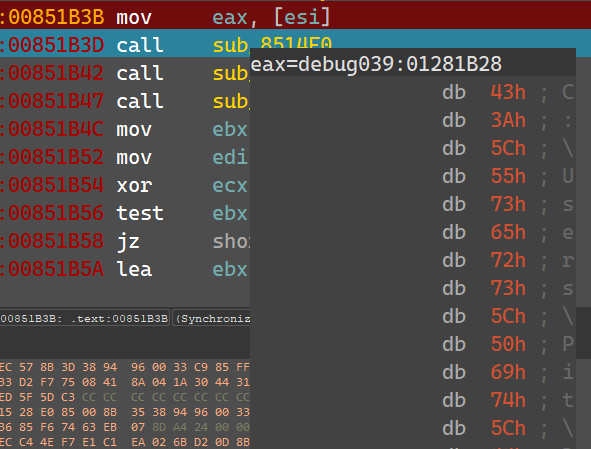
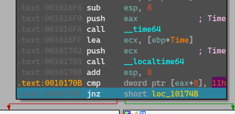
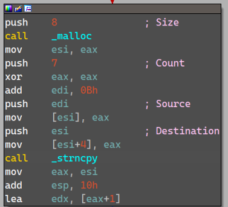

# Flare-On 2014 Challenge 7 Walkthrough: Decoding Obfuscated Executable by Brute Forcing

This walkthrough explains how I reversed and debugged the executable, the anti-debugging tricks employed by it, and how I finally revealed the valid executable. Along the way, I will highlight key points, anti-debugging techniques, and explain each function's purpose.

---

## Table of Contents

- [Introduction](#introduction)
- [Step 1: Initial Analysis](#step-1-initial-analysis)
- [Step 2: Basic Dynamic Analysis](#step-2-basic-dynamic-analysis)
- [Step 3: Analyze with IDAPro](#step-3-analyze-with-idapro)
- [Step 4: Understanding XOR Functions](#step-4-understanding-xor-functions)
    - [4.1 `sub_951030`: Debugger Check - Windows API](#41-sub_951030-debugger-check---windows-api)
    - [4.2 `sub_9510C0`: Debugger Check - Process Environment Block](#42-sub_9510c0-debugger-check---process-environment-block)
    - [4.3 `sub_951130`: VMware Detection - Hypervisor Check (RedPill)](#43-sub_951130-vmware-detection---hypervisor-check-redpill)
    - [4.4 `sub_9511D0`: VMware Detection - VMX I/O Port](#44-sub_9511d0-vmware-detection---vmx-io-port)
    - [4.5 `sub_9512A0`: Debugger Check - Debug Strings](#45-sub_9512a0-debugger-check---debug-strings)
    - [4.6 `sub_951350`: Confuse Researcher - Software Breakpoint Counting](#46-sub_951350-confuse-researcher---software-breakpoint-counting)
    - [4.7 `sub_9513F0`: Debugger Check - NtGlobalFlags](#47-sub_9513f0-debugger-check---ntglobalflags)
    - [4.8 `sub_951460`: Confuse Researcher - Friday Check](#48-sub_951460-confuse-researcher---friday-check)
- [Step 5: Program Path](#step-5-program-path)
- [Step 6: Further Function Analysis](#step-6-further-function-analysis)
    - [6.1 `sub_9514F0`: Confuse Researcher - Executable Name Check](#61-sub_9514f0-confuse-researcher---executable-name-check)
    - [6.2 `sub_951590`: Dynamic Debugging Check - IP Address Resolution](#62-sub_951590-dynamic-debugging-check---ip-address-resolution)
    - [6.3 `sub_9516E0`: Confuse Researcher - 5PM Check](#63-sub_9516e0-confuse-researcher---5pm-check)
- [Step 7: XOR Data with Executable Path](#step-7-xor-data-with-executable-path)
- [Step 8: More Manipulations](#step-8-more-manipulations)
    - [8.1 `sub_9517A0`: Dynamic Debugging Check - Root Server Check](#81-sub_9517a0-dynamic-debugging-check---root-server-check)
    - [8.2 `sub_9518A0`: Dynamic Debugging Check - Tweet Check](#82-sub_9518a0-dynamic-debugging-check---tweet-check)
- [Step 9: Continue to `gratz.exe`](#step-9-continue-to-gratzexe)
    - [9.1 Overwrite Existing Bytes](#91-overwrite-existing-bytes)
    - [9.2 Dump `gratz.exe`](#92-dump-gratzexe)
    - [9.3 Brute-Forcing the Correct Executable](#93-brute-forcing-the-correct-executable)
- [Step 10: Extracting the FLAG](#step-10-extracting-the-flag)
    - [10.1 Decoding Data](#101-decoding-data)
- [Final Note](#final-note)
- [Reference](#reference)

---

### Introduction

This walkthrough focuses on analyzing and reversing the Flare-On 2014 Challenge 7 binary. Key objectives include:

- XORed Raw Data: Identifying and reversing XOR operations.
- Brute-Force Script: Creating a script to explore execution paths for a valid executable.
- Obfuscated .NET Executable: Decoding a .NET executable to extract the flag.
  
---

### Step 1: Initial Analysis

The executable is detected as a **Windows** binary.

- **DIE** (Detect It Easy) marks the file as an executable.
- The file **stops execution after a few seconds**.
- **ApateDNS** shows several DNS requests:
  
    

---

### Step 2: Basic Dynamic analysis

I monitored the execution of the executable using Procmon with 0 to 2 arguments.
  - It was observed that when 2 arguments are provided, there is a reference to `gratz.exe`.
    
    

---

### Step 3: Analyze with IDAPro

I loaded the executable into IDA Pro for a more detailed analysis.

- Within the **main function**, it was observed that the program writes data to `gratz.exe`:

  

- Also, we can see that the name of the failed executable is mentioned at the end of the block:

  

---

### Step 4: Understanding XOR Functions

To proceed, I reverse-engineered each function involved in the binary’s execution from the start of `main` up until the attempt to execute `gratz.exe`:

- #### 4.1. `sub_951030`: Debugger Check - Windows API

    - The function verifies if a debugger is attached by using the Windows API function `IsDebuggerPresent`.
    - It is also identified that `dword_969438` represents the size of the data being modified in this function.
    - Additionally, a block of data, `byte_8631F8`, is modified using an XOR operation within this function.
        - In each branch of the XORing functions, we observe that the data being modified corresponds to the value pointed to by this variable. 

    
    

- #### 4.2. `sub_9510C0`: Debugger Check - Process Environment Block

    - The **TEB** (Thread Environment Block) is referenced by the **FS** register.
      - The **PEB** (Process Environment Block) is located at offset `30h` within the TEB.
      - To check the `BeingDebugged` flag, it can be found 2 bytes after the start of the **PEB** structure.
    
    
    

- #### 4.3. `sub_951130`: VMware Detection - Hypervisor Check (RedPill)

    - The `sidt` instruction is used to retrieve the **IDT** (Interrupt Descriptor Table) and store it in memory.
    - VMware presence is detected by inspecting the IDT base address.
      - This check specifically looks for the **VMware signature** (`FF` at the end of the address).
        - Reference: [SIDT](https://www.aldeid.com/wiki/X86-assembly/Instructions/sidt)
    
      
      

- #### 4.4. `sub_9511D0`: VMWare Detection - VMX I/O Port

    - The `in` instruction with the specified input indicates a check for the VMware hypervisor, specifically the VX "backdoor" I/O port used by VMware.
      - Reference: [VMware AntiDebug](https://ctf-wiki.mahaloz.re/reverse/windows/anti-debug/example)
        
      
      - The **EBX** register is populated with the magic number of the I/O port (VX).
        - If an exception occurs due to the absence of a VMware hypervisor, it will trigger a call to this function (`sub_9511D0`).
          
          
            - Reference: [VMware detection](https://www.aldeid.com/wiki/VMXh-Magic-Value)  
              - This demonstrates how an exception is implemented in assembly based on C code.

- #### 4.5. `sub_9512A0`: Debugger Check - Debug Strings

    - If no debugger is attached, the error code will be modified.

      
      

- #### 4.6. `sub_951350`: Confuse Researcher - Software Breakpoint Counting

    - This function detects the presence of **software breakpoints**, specifically the `0xCC` opcode commonly used for breakpoints in debuggers.
      - There are 78 instances of `0xCC` found when no debugger is attached.
          - You can use the following IDAPython code to count them yourself :)

        ```python
        def count_occurrences_in_range(file_path, target_byte, start_offset, end_offset):
            # Open the file in binary mode
            with open(file_path, 'rb') as file:
                # Move the cursor to the start_offset
                file.seek(start_offset)
                
                # Read the bytes between start_offset and end_offset
                file_data = file.read(end_offset - start_offset)
            
            # Count occurrences of target_byte in the specified range
            count = file_data.count(target_byte)
            
            return count
        
        # Usage example
        file_path = 'd69650fa6d4825ec2ddeecdc6a92228d.exe'  # Replace with your file path
        target_byte = b'\xCC'  # The byte to search for, in this case 0xCC
        start_offset = 0x30  # The starting offset (30 bytes from the beginning)
        end_offset = 0x780  # The ending offset (780 bytes from the beginning)
        
        count = count_occurrences_in_range(file_path, target_byte, start_offset, end_offset)
        print(f"The byte 0xCC appears {count} times between offset {start_offset} and {end_offset}.")

        ```
      - This is likely intended to obscure the analysis process.
    
    

- #### 4.7. `sub_9513F0`: Debugger Check - NtGlobalFlags

    - This technique checks the **NtGlobalFlags** value for **debugger flags** that may signal the presence of a debugger.
      - Relevant flags include:
        - `TAIL_CHECK` (0x10)
        - `FREE_CHECK` (0x20)
        - `VALIDATE_PARAMETERS` (0x40)
      - These flags are used to ensure proper memory and heap operations, highlighting irregularities introduced by debuggers.
  
    
    

- #### 4.8. `sub_951460`: Confuse Researcher - Friday Check

    - The `time64` function returns the time elapsed since midnight, January 1, 1970.
        - Reference: [C++ Documentation](https://cplusplus.com/reference/ctime/tm/)
          - The 7th integer (`wday`) at offset 24 (18h) represents the day of the week.
          - Values range from 0 (Sunday) to 5 (Friday).
    
    
    

---

### Step 5: Program Path

At this point, **`EAX`** contains the path of the executable. Further analysis proceeds with additional function reverse-engineering.

  

---

### Step 6: Further Function Analysis

- #### 6.1. `sub_9514F0`: Confuse Researcher - Executable Name Check

    - The program compares the executable name to **backdoge.exe**.
      - The comparison is performed two characters at a time.
    
      

    - Then:
      
      

- #### 6.2. `sub_951590`: Dynamic Debugging Check - IP Address Resolution

    - The function resolves the **IP address** and checks if it matches **localhost** (127.0.0.1).
      - Resolution process:
    
        
        - The resolved IP address is also compared two characters at a time.
      
    - Associated strings:
    
        

- #### 6.3. `sub_9516E0`: Confuse Researcher - 5PM Check

    - The function checks if the current time is **5 PM** by examining the `tm_hour` field from the `time64` structure.
  
        
        

    - Associated strings:
      
        

---

### Step 7: XOR Data with Executable Path

- Immediately following these functions, we observe a block of code that also performs an XOR operation on the data.
  
  
  
  - It is important to note that the program checks for a specific executable name: `backdoge.exe`.

--- 

### Step 8: More Manipulations:

- #### 8.1. `sub_9517A0`: Dynamic Debugging Check - Root Server Check

- The malware attempts to contact **`e.root-servers.net`** for validation.
  
  

  - It checks and **XORs** raw data with a hardcoded **IP address**.
  
      

- #### 8.2. `Sub_9518A0`: Dynamic Debugging Check - Tweet Check

Here’s a more professional revision of the text:

- First, the malware sets its user-agent to `ZBot`:
  - [Reference](https://www.proofpoint.com/us/threat-reference/zeus-trojan-zbot)

  

- Next, the following URL is constructed in memory:

  

- Its content is checked for the string: `Secluded Hi`

  

- After this, 8 characters are copied to newly allocated memory:

  

- Since the tweet isn't accessible today, I managed to retrieve it from old solutions:

  

  - According to this, `Secluded Hi` is found just before `jackRAT` at offset `Bh` (11) from the found Sub-String.
  - The string `jackRAT` (7 characters) is then copied to the allocated buffer.

- Subsequently, the data is XORed again:

  
  
---

### Step 9: Continue to `gratz.exe`

- #### 9.1. Overwrite existing bytes

    - When debugging this block, we observe that the executable arguments are being referenced.
    
      - Let’s examine what is being written to `data_raw`:
    
        
    
      - The first byte of `data_raw` corresponds to the first character of **`arg[1][0]`**.
      - The second byte (`byte_8631F9`) corresponds to the second byte of **`arg[1][1]`**.
      - The third byte (`byte_863278`) corresponds to the first byte of **`arg[2][0]`**.
      - The fourth byte (`byte_863279`) corresponds to the second byte of **`arg[2][1]`**.
    
      - According to the DOS Header and PE Header of a legitimate Windows executable, the values at these offsets are as follows:
        - `magic number`: `MZ`
        - `signature`: `PE`
    
        - [Reference](https://markpelf.com/1628/pe-format-illustrated-part-1/)

- #### 9.2. Dump `gratz.exe`
    
    - The manipulated XORed data is dumped to this executable:
    
      
    
    - Let’s examine the data before all the manipulations, including the XOR operations performed at each step.
    ```python
    import idaapi

    # Specify the address and the size to dump
    start_address = <Start_Address>
    size_to_dump = 0x106240  # 106240 in hexadecimal

    # Open a file to dump the data
    output_filename = "dumped_data.bin"
    with open(output_filename, "wb") as output_file:
        # Read the specified memory range and write it to the output file
        for offset in range(size_to_dump):
            byte = idaapi.get_byte(start_address + offset)
            output_file.write(bytes([byte]))

    print(f"Data dumped to {output_filename}")

    ```
    - Due to the numerous checks performed prior to this step, including some designed to obfuscate the analysis, I have decided to proceed with a brute-force approach to determine the correct sequence that will result in a functional executable.

- #### 9.3. Brute-Forcing the Correct Executable

    - After analyzing the values being XORed with `raw_data` according to the relevant and irrelevant execution paths, I wrote a script (`xor_raw_data.py`) to brute-force the execution path and search for a valid executable:
        - The script checks for the presence of `MZ` at the beginning of the file (without calculating all the XORed data).
        - The current combinations are:
          1. `the final countdown` → `omglob` → `you're so good` → `f` → `I'm gonna sandbox your face` → `Such fire. Much burn. Wow.` → `\t\x00\x00\x01` → `! 50 1337` → `MATH IS HARD` → `SHOPPING IS HARD` → `\x01\x02\x03\x05\x00x08\r` → `backdoge.exe` → `192.203.230.10` → `jackRAT`
          2. `the final countdown` → `omglob` → `you're so bad` → `f` → `I'm gonna sandbox your face` → `Such fire. Much burn. Wow.` → `\t\x00\x00\x01` → `! 50 1337` → `MATH IS HARD` → `SHOPPING IS HARD` → `\x01\x02\x03\x05\x00x08\r` → `backdoge.exe` → `192.203.230.10` → `jackRAT`
    - Once the script finishes executing, it saves the found candidates to the local folder:
    
      

---

### Step 10: Extracting the FLAG

After successfully executing the program, I analyzed its contents:

  

- Using **DNSpy**, I was able to identify key functions:
  - The **Form1** function spawns a new thread that runs the **luluzors** function:

      
      
    

- #### 10.1. Decoding Data

    - The program contains several encoded strings used as input for the implemented decoders in this .NET file.
      - To decode them, we can convert the logic to Python and use the **`dotnet_decoders.py`** script to print the decoded strings.
    
    - **Decoding** is performed using the **`dotnet_decoders.py`** script to extract the FLAG:

      ```python
      The wanted: da7.f1are.finish.lin3@flare-on.com
      Decoded String 1 (decoder1): Dat Beacon:
      -----------------------------------
    
      Decoded String 2 (decoder2): Machine:
      Decoded String 3 (decoder3): UserDomain:
      Decoded String 4 (decoder1): User:
      Decoded String 5 (decoder2): OS Version:
      Decoded String 6 (decoder3): Drive:
      Decoded String 7 (decoder3): Noms:
      Decoded Email Address: al1.dat.data@flare-on.com
      Decoded Subject: I'm a computer
      Decoded Sender: lulz@flare-on.com
      Decoded SMTP Server: smtp.secureserver.net
      ```
      
---

### Final Note

Before concluding, I checked the **datwork function** to observe what data gets attached to an email. It turns out this data includes:

- **Decoded Strings**: Information like machine name, user domain, and more.
- **Email Details**: 
  - **Recipient**: al1.dat.data@flare-on.com
  - **Sender**: lulz@flare-on.com
  - **SMTP Server**: smtp.secureserver.net

This highlights the importance of running suspicious files in a **controlled environment** to prevent any potential damage or data leaks.

---

### Reference

- **IDA Pro**: A disassembler used to analyze the binary and trace XOR operations in the code.
- **IDAPython**: An automation tool for IDA Pro, used to script tasks and analyze code paths.
- **DNSpy**: A .NET decompiler for analyzing and decoding obfuscated .NET executables and strings.
- **VM Detection Techniques**: Methods to detect if the program is running in a virtual machine, crucial for bypassing certain protections.
- **Dynamic Anti-Debug Techniques**: Techniques used to identify and bypass debugger detection during runtime.


