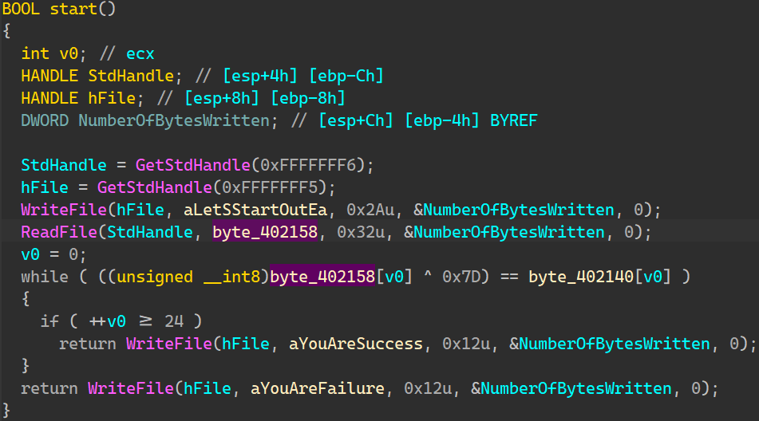

# Flare-On 2015 Challenge 1 Walkthrough: Cracking a Password For an Executable

This walkthrough focuses on cracking the password requested by an executable, uncovering how the password is hidden and subsequently decoded.

## Table of Contents
- [Introduction](#introduction)
- [Step 1: Simple Execution](#step-1-simple-execution)
- [Step 2: Opening the File with IDA](#step-2-opening-the-file-with-ida)
- [Step 3: Extracting and Decoding the XOR Buffer](#step-3-extracting-and-decoding-the-xor-buffer)
- [Step 4: The Flag](#step-4-the-flag)
- [References](#references)

---

## Introduction

In this challenge, the goal is to extract and decode a hidden password from an executable file. The password is concealed using an XOR operation. Throughout this walkthrough, we will analyze the binary file, extract the necessary data buffers, and use tools like IDA and CyberChef to decode the secret. By the end, we will reveal how to obtain the correct password.

---

## Step 1: Simple Execution

- **DIE** confirms that the file is an executable.
- **Simple execution** shows a prompt asking for a password.

    

- At this point, the file is requesting input from the user (a password), but it is not clear how the input is being processed or what kind of transformation occurs.

---

## Step 2: Opening the File with IDA

Next, we open the executable file in **IDA Pro**, a popular disassembler, to inspect its structure. IDA allows us to view the assembly code and identify key parts of the program, including buffers and functions involved in the decryption process.

- **Decompiled view**: It shows how the program handles user input. Specifically, the input is passed through `ReadFile` and stored in the `byte_402158` buffer.
    - Each character from the user input is XORed with the value `0x7D` and compared to a corresponding character in the `byte_402140` buffer.

    

- This transformation of the input is critical in identifying how the password is concealed.

- **XOR operation**: The input buffer at `byte_402158` is XORed with `0x7D` and compared to the value stored in `byte_402140`.

    

---

## Step 3: Extracting and Decoding the XOR Buffer

Now that we understand how the input is XORed, we need to extract the relevant buffer and apply the XOR decryption.

- **Extracting the XOR buffer**: We dump the buffer from memory at the addresses `0x402140` to `0x402158`. The extracted data is a 24-byte sequence, which we convert into an array.

   

    ```python
    [+] Dump 0x402140 - 0x402158 (24 bytes) :
    1F08131304220E114D0D183D1B111C0F18501213531E1210
    ```

- **Decoding the buffer**: Using **CyberChef**, we apply the XOR operation with the key `0x7D` to the extracted buffer.

    

- After applying the XOR operation, we successfully recover the original password.

---

## Step 4: The Flag

- **Decoded message**: The password revealed by the XOR operation is the hidden flag.

    

- **Flag**: The decoded message is the password that unlocks the challenge.

---

### References

- **DIE**: A tool used for identifying file types and analyzing the structure of binary files. It helps determine the format of executable files.
- **IDA Pro**: A powerful disassembler and debugger used for reverse engineering binaries. It provides detailed insights into the program’s functions and memory structures.
- **CyberChef**: A web-based tool that simplifies data analysis and transformations. It is especially useful for tasks like XOR, base64 encoding/decoding, and more.

---
