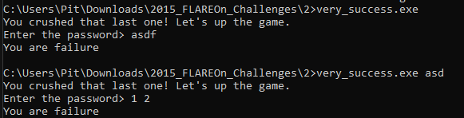
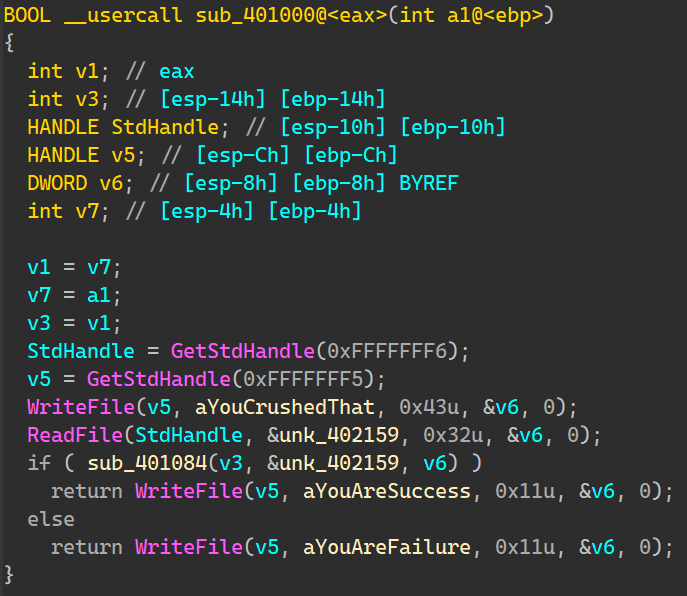
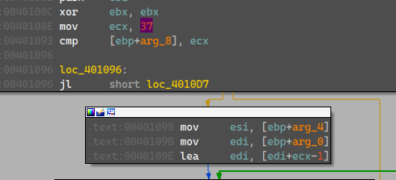
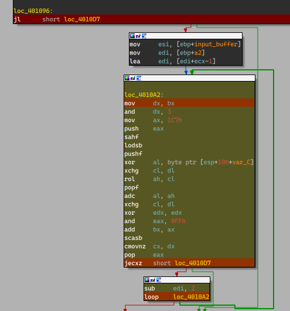
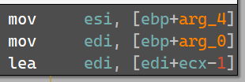
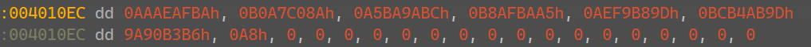

# Flare-On 2015 Challenge 2 Walkthrough: Cracking a More Complex Password

This walkthrough provides a comprehensive guide to analyzing an executable and cracking the password required for execution. The process involves reverse-engineering the executable, extracting key data, and ultimately deciphering the password.

## Table of Contents
- [Introduction](#introduction)
- [Step 1: Simple Execution and File Identification](#step-1-simple-execution-and-file-identification)
- [Step 2: Opening the Executable with IDA Pro](#step-2-opening-the-executable-with-ida-pro)
- [Step 3: Dynamic Debugging and Tracing the Password Check Logic](#step-3-dynamic-debugging-and-tracing-the-password-check-logic)
- [Step 4: Analyzing the Password Check Logic](#step-4-analyzing-the-password-check-logic)
- [Step 5: Dumping the Secret Using IDA Python](#step-5-dumping-the-secret-using-ida-python)
- [Step 6: Decryption Script](#step-6-decryption-script)
- [References](#references)

---

## Introduction

In this challenge, we need to determine the correct password for an executable that performs a password check. By carefully analyzing the executable, we can extract the relevant data, understand how the password is processed, and reverse-engineer the logic to recover the password.

---

## Step 1: Simple Execution and File Identification

The first step is to identify the file as an executable. We use the **DIE** tool to verify its file type and confirm that it's an executable binary.

- After executing the file, we are prompted to enter a password:

    

---

## Step 2: Opening the Executable with IDA Pro

We open the executable in **IDA Pro** to examine its code. The disassembler reveals key sections, including buffers and functions that are involved in password verification.

- From the disassembly, we locate the password stored in `unk_402159`, which is passed to the function `sub_401084` for further processing.

    

---

## Step 3: Dynamic Debugging and Tracing the Password Check Logic

Next, we use dynamic debugging to trace the execution of the password-checking function. By following the execution flow, we gain insight into how the password is processed and validated.

- The program expects the password to be 37 characters long:

    

- We observe the manipulation of data as the password is checked:

    

    - The data used in the password validation process is visible here:

        

---

## Step 4: Analyzing the Password Check Logic

By examining how the registers are manipulated during the password decryption process, we can decipher the logic behind the password validation. The process involves performing bitwise operations on the input password, specifically XORing each character with a constant `0xC7`, followed by other operations like `ROL` and `ADC`.

```python
AX = [0, 0]    
BX = [0, 0]     
CX = [0, 0x25]  
DX = [0, 0]     

KEY_XOR = 0xC7
# Start the loop over each character in the input string
for i, char in enumerate(input_str):

    DX = BX             # MOV DX,BX
    DX[1] &= 3          # AND DX,3h
    AX = [0x01, 0xC7]   # MOV AX,1C7h
    CF = 0x01           # SAHF (CF = AH[0] = 1(const))

    # LOADSB (AL = EDI, EDI++ (while DF = 0))
    # XOR (AL,C7h)
    AX[1] = ord(char) ^ KEY_XOR

    # XCHG (CL,DL)
    TEMP_CL = CX[1]
    CX[1] = DX[1]
    DX[1] = TEMP_CL

    # ROL (AH, CL)
    AX[0] <<= CX[1]

    # ADC (AL,AH) (AL = AL + AH + CF)
    AX[1] += AX[0] + CF

    # XCHG (CL,DL)
    TEMP_CL = CX[1]
    CX[1] = DX[1]
    DX[1] = TEMP_CL

    # XOR (DX,DX)
    DX = [0,0]

    # AND (AX,0FFh) (AX[0] = 0)
    AX = [0, AX[1]]
    BX += AX
```

- After processing each character of the password, the final values of the registers are compared. If they match, the password is deemed correct.

    - Key operations involved include:
        - `scasb`: compares `AL` with the byte at `ES:EDI` and sets the flags.
        - `cmovnz`: moves `DX` to `CX` if `ZF=0`, zeroing `CX` if the values don't match.
        - `jecxz`: jumps if `ECX` is zeroed -> so we want to go left.

---

## Step 5: Dumping the Secret Using IDA Python

We use IDA Python to dump the data stored in the `ES:EDI` register. This data, which is generated during the execution, contains the information necessary to reverse-engineer the password.

- The `EDI` register is initialized with an offset, which can be tracked during the execution:

    
    

- The following Python script helps dump the data backward from the given address:

    ```python
    import idc

    def dump_data_backward(start_address, size):
        """
        Dumps data backward from the given start_address for the given size and prints it.
        
        Parameters:
        start_address (int): The address to start dumping data from.
        size (int): The number of bytes to dump from the address.
        """
        dumped_data = []

        # Iterate backward from the given start address
        for offset in range(size):
            current_address = start_address - offset
            byte_value = idc.get_wide_byte(current_address)
            dumped_data.append(f"{byte_value:02X}")

        # Print the hex dump
        print(" ".join(dumped_data))

    # Example Usage: Modify these values as needed
    start_addr = 0x402140  # Start address (change as needed)
    size = 37  # Number of bytes to dump (change as needed)

    dump_data_backward(start_addr, size)
    ```

    - Example Output:

    ```
    A8 9A 90 B3 B6 BC B4 AB 9D AE F9 B8 9D B8 AF BA A5 A5 BA 9A BC B0 A7 C0 8A AA AE AF BA A4 EC AA AE EB AD AA AF
    ```

---

## Step 6: Decryption Script

After extracting the relevant data, you can use the `crack_password.py` script (available in the repository) to decrypt the password. The script applies the reverse operations on the extracted data to reveal the original password.

The decrypted password is:

```
a_Little_b1t_harder_plez@flare-on.com;
```

---

### References

- **DIE**: A tool for identifying the type and structure of executable files.
- **IDA Pro**: A powerful disassembler used to analyze binary executables.
- **IDA Python**: The Python API for automating and extending IDA Pro's functionality.
- **CyberChef**: A web-based tool used for encoding, decoding, and applying various data transformations.

---
