# Flare-On 2015 Challenge 3 Walkthrough: Extracting the Flag from PyInstaller Executable

In this guide, we’ll break down the process of extracting the flag hidden inside a Windows executable. This challenge involves unpacking a PyInstaller-packed executable, decompiling the extracted code, and reversing a simple obfuscation to uncover the flag.

## Table of Contents
- [Introduction](#introduction)
- [Step 1: DIE Detects it as a Windows Executable](#step-1-die-detects-it-as-a-windows-executable)
- [Step 2: Identifying Python Compiled Code](#step-2-identifying-python-compiled-code)
- [Step 3: Extracting Files with PyInstaller](#step-3-extracting-files-with-py-installer-extractor)
- [Step 4: Inspecting the Decompiled Python Code](#step-4-inspecting-the-decompiled-python-code)
- [Step 5: Deobfuscating the Code](#step-5-deobfuscating-the-code)
- [Step 6: The Flag](#step-6-the-flag)
- [References](#references)

--- 

## Introduction

In this challenge, we need to extract a hidden flag embedded inside a Windows executable (`elfie.exe`). Upon analysis, the file is determined to be a Python program that has been packed using **PyInstaller**, a popular tool for packaging Python applications into standalone executables.

We will walk through the steps of unpacking and decompiling the executable, and then reversing some basic obfuscation techniques to reveal the flag.

---

## Step 1: DIE Detects it as a Windows Executable

The first step in the analysis is using **DIE (Detect It Easy)** to identify the type of the file. DIE immediately recognizes `elfie.exe` as a Windows executable, providing us with basic file information, which is the first clue in understanding how to unpack it.


- After inspecting the file, we can see that it is indeed a Windows binary, but this doesn't give us the full picture. We now need to determine the specific format used to pack the executable.

---

## Step 2: Identifying Python Compiled Code

Upon further inspection, it looks like the executable is Python code that has been compiled into bytecode and packaged with **PyInstaller**. PyInstaller is a tool that bundles Python applications along with the Python interpreter and all necessary libraries into a single executable file.

### Key Indicators:
- **_MEIPASS2**: This environment variable is often set during the unpacking process by PyInstaller. It points to a temporary directory where files are unpacked at runtime.
  
    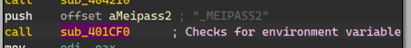
    - [Reference - PyInstaller](https://pyinstaller.org/en/stable/runtime-information.html)
- **PyInstaller Icon**: Tools like CFF Explorer show the icon associated with files packed by PyInstaller.

    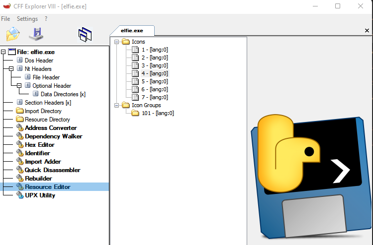

- **Accessed Resources**: Using ProcMon, We can see python resources that are accessed via the TMP folder

    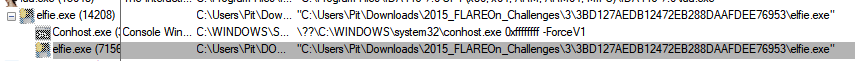
    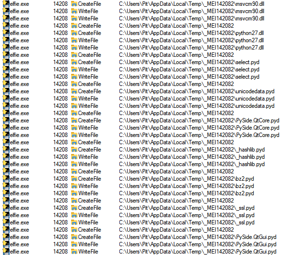

- **Strings**: The main executable spawn an unpacked version of it.
    - We can see a difference in size of the process while executed:   
        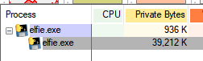

    - Packed (Original):
    
        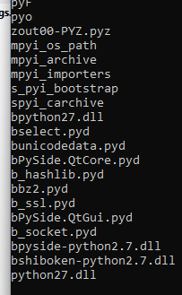
    - Unpacked:
        - We can spot a python code with obfuscated variable names and strings:
    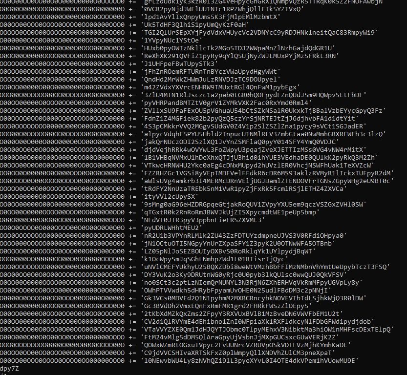

- **Overlay**: A compiled python file consists of PYZ file which is an archive for resources relevant for the executable.          

    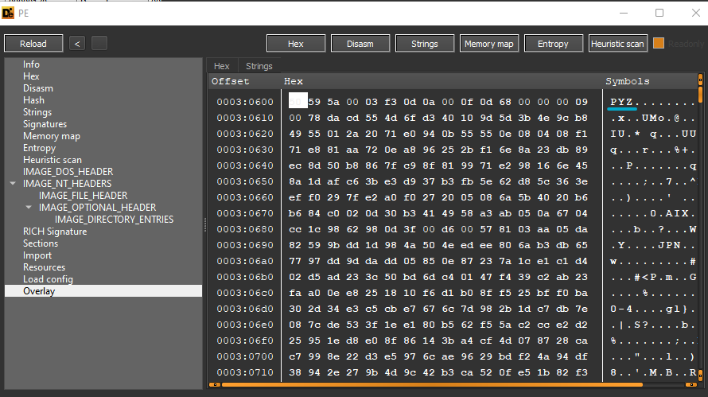
        
    - [Reference - PYZ](https://docs.python.org/3/library/zipapp.html)
            
    - [Malicious behaviour to utilize pyextractor](https://medium.com/@ggezy/how-i-defeated-pyinstxtractor-5d32d65272a)
---

## Step 3: Extracting Files with Py Installer Extractor

Next, we use the **pyextractor** tool to unpack the `elfie.exe` executable and extract the Python files. PyInstaller wraps Python bytecode in a special format, and `pyextractor` can help us extract these files from the executable ([Reference](https://github.com/extremecoders-re/pyinstxtractor))

- The extraction process begins by running the following command:

    ```bash
    python pyinstall_extractor.py elfie.exe
    ```

### Output:

```
[+] Processing elfie.exe
[+] PyInstaller version: 2.1+
[+] Python version: 2.7
[+] Length of package: 12034944 bytes
[+] Found 26 files in CArchive
[+] Beginning extraction...please standby
[+] Found 244 files in PYZ archive
[+] Possible entry point: _pyi_bootstrap.pyc
[+] Possible entry point: pyi_carchive.pyc
[+] Possible entry point: elfie.pyc
[+] Successfully extracted pyinstaller archive: elfie.exe
```

- After extracting the files, we can see that a number of Python bytecode files (.pyc) are present. Among these, `elfie.pyc` is likely the main script, so we focus on it for further analysis.

---

## Step 4: Inspecting the Decompiled Python Code

- Once decompiled, we can inspect the code and identify the key components. In particular, we see the same strings we previously observed in the dumped process created by the `elfie.exe` executable. 

    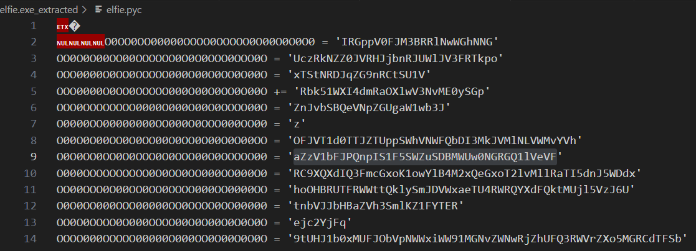

---

## Step 5: Deobfuscating the Code

We observe some obfuscation in the code, which is likely intended to confuse or hide the flag. 

   - At the end of the decompiled code is:
        
        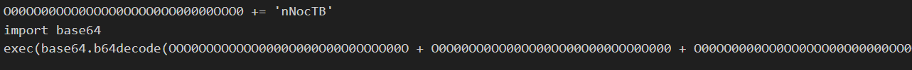

To simplify the analysis, we convert the execution code into a `print` statement, which will output the deobfuscated code directly to the terminal.

- The script needs to be executed using Python 2.7, as the original code was compiled with Python 2.7.

The output from the decompiled code reveals a string that is partially reversed.

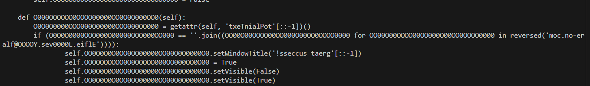

---

## Step 6: The Flag

- After reversing the string revealed by the deobfuscated Python code, using CyberChef, we find the hidden flag:
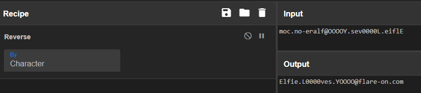

```
Flag: Elfie.L0000ves.YOOOO@flare-on.com
```
---

### References

- **PyInstaller Documentation**: Provides information on how PyInstaller packages Python applications into standalone executables.  
- **pyinxtractor**: A tool used to extract files packed with PyInstaller.
