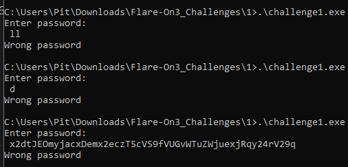
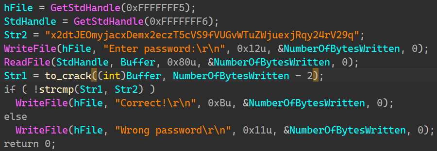
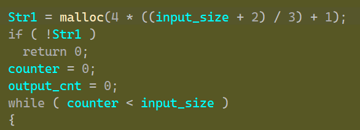
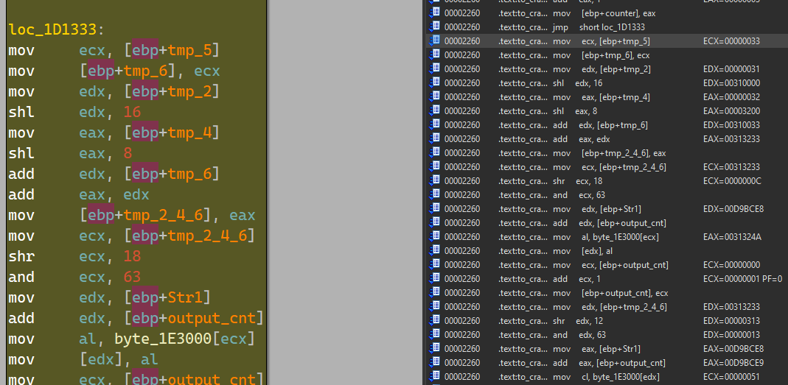
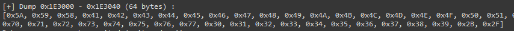
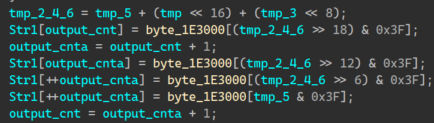
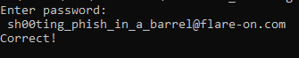

# Flare-On 2016 Challenge 1 Walkthrough: Cracking the Password

Welcome to the walkthrough for solving one of the Flare-On challenges! In this guide, we will detail the process of cracking the password hidden within a binary executable.

## Table of Contents
- [Introduction](#introduction)
- [Step 1: Simple Execution](#step-1-simple-execution)
- [Step 2: Static Analysis with IDA Pro](#step-2-static-analysis-with-ida-pro)
- [Step 3: Exploring the `to_crack` Function](#step-3-exploring-the-to_crack-function)
    - [3.1. Encoding Phase](#31-encoding-phase)
    - [3.2. Analysis of the Encoding Process](#32-analysis-of-the-encoding-process)
- [Step 4: Decoding the Password](#step-4-decoding-the-password)
- [Step 5: The Flag](#step-5-the-flag)
- [References](#references)

---

## Introduction

In this challenge, the objective is to crack a password hidden within a binary file. The password is manipulated using an encoding function that employs a hard-coded key along with bitwise operations. We will walk through the process of decompiling the binary, analyzing the encoding mechanism, and ultimately cracking the password using a Python script.

The decoding process follows three main phases:

1. **Input manipulation using a hard-coded key**  
2. **Bitwise operations on the password string**  
3. **Comparison of the encoded password with the expected value**

---

## Step 1: Simple Execution

- Upon running the binary, we observe that it expects user input but does not immediately reveal the password. This suggests that the input is being processed and compared to some internal value, prompting a deeper dive into the binary.

    

---

## Step 2: Static Analysis with IDA Pro

- The binary performs a string comparison between two hard-coded strings: `Str1` and `Str2`.
- The input is passed through a `Buffer` and encoded in the `to_crack` function.

At this point, we begin to investigate the `to_crack` function in greater detail.



---

## Step 3: Exploring the `to_crack` Function

- The `to_crack` function is responsible for manipulating the input string and comparing it with `Str2`. Upon further inspection, we see that `Str1` is allocated according to the password length, and the function enters a loop to process the password.

    

- ### 3.1. Encoding Phase:
    - The encoding process was traced to better understand how the password is transformed:

        

    - The key `byte_1E3000` is used for encoding the password.
    - This key is 64 bytes in size and is hard-coded in the binary.

        

    - The main manipulation steps in this phase are as follows:

        

- ### 3.2. Analysis of the Encoding Process:

    The following pseudo-code illustrates the encoding logic within the `to_crack` function:

    ```python
    byte_1E3000 = [0x5A, 0x59, 0x58, 0x41, 0x42, 0x43, 0x44, 0x45, 0x46, 0x47, 0x48, 0x49,
        0x4A, 0x4B, 0x4C, 0x4D, 0x4E, 0x4F, 0x50, 0x51, 0x52, 0x53, 0x54, 0x55,
        0x56, 0x57, 0x7A, 0x79, 0x78, 0x61, 0x62, 0x63, 0x64, 0x65, 0x66, 0x67,
        0x68, 0x69, 0x6A, 0x6B, 0x6C, 0x6D, 0x6E, 0x6F, 0x70, 0x71, 0x72, 0x73,
        0x74, 0x75, 0x76, 0x77, 0x30, 0x31, 0x32, 0x33, 0x34, 0x35, 0x36, 0x37,
        0x38, 0x39, 0x2B, 0x2F]
    ```
    ```python
    # A loop performs the following:
        cnt = 0, output_cnt = 0
        for cnt < input_size:
            Init:
                tmp_2 = input_str[cnt++]
                tmp_4 = input_str[cnt++]
                tmp_6 = input_str[cnt++]
            Process:
                Block_1:
                    EDX = tmp_2 << 16
                    EAX = tmp_4 << 8
                    EDX += tmp_6
                    EAX += EDX
                    tmp_246 = EAX
                Block_2:
                    ECX = tmp_246 >> 18
                    ECX = ECX & 63 # RD_Index
                    output_str[output_cnt] = byte_1E3000[ECX]
                    output_cnt++
                Block_3:
                    EDX = tmp_246 >> 12
                    EDX = DEX & 63 # RD_Index
                    output_str[output_cnt] = byte_1E3000[EDX]
                    output_cnt++
                Block_4:
                    EAX = tmp_246 >> 6
                    EAX = EAX & 63 # RD_Index
                    output_str[output_cnt] = byte_1E3000[EAX]
                    output_cnt++
                Block_5:
                    ECX = tmp_246 >> 0
                    ECX = ECX & 63 # RD_Index
                    output_str[output_cnt] = byte_1E3000[ECX]
                    output_cnt++
    ```

---

## Step 4: The Flag

- After writing a decoding script `crack_pass.py`, I successfully derived the password, which also serves as the **flag**:

    ```
    sh00ting_phish_in_a_barrel@flare-on.com
    ```

    

---

## References

- **IDA Pro** for static and dynamic debugging of executables.
